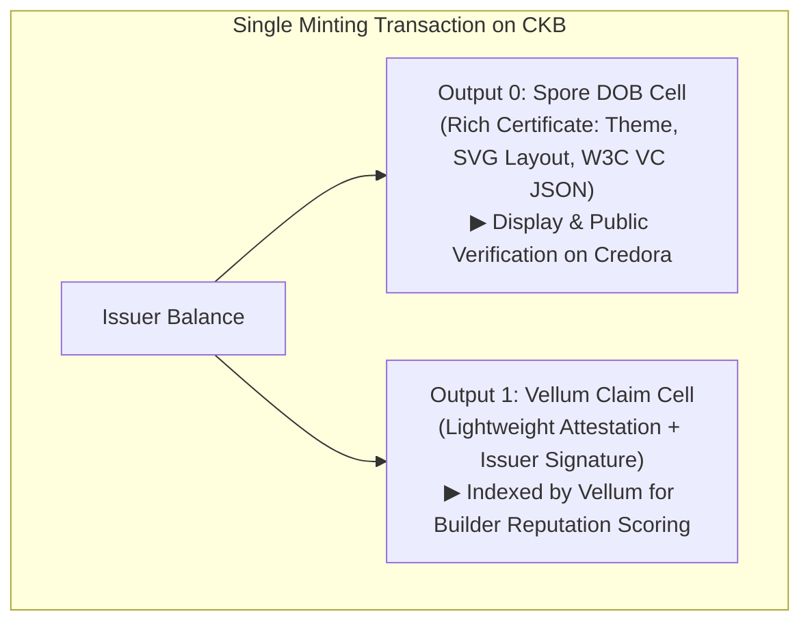

# Credora (CKB Credential Registry)


[](LICENSE)
[](https://nextjs.org)

A verifiable credentials system built on Nervos CKB using the Spore Protocol. Issue, manage, and verify course completion certificates as on-chain credentials.

## Tech Stack

- **Blockchain**: Nervos CKB
- **Credential Standard**: W3C Verifiable Credentials
- **Storage**: Spore Protocol (DOB/Cluster cells)
- **SDK**: CCC SDK (@ckb-ccc/core, @ckb-ccc/connector-react, @ckb-ccc/did-ckb)
- **Identity / DID**: @ckb-ccc/did-ckb (`did:ckb` resolver & portable identity)
- **Frontend**: Next.js 14, React, TypeScript, Tailwind CSS
- **State**: React Query

## Prerequisites

1. **Node.js** 18+ installed

## Quick Start

### 1. Install Dependencies

```bash
npm install
```

### 2. Start Development Server

```bash
npm run dev
```

Open [http://localhost:3000](http://localhost:3000) to view the app.

### 3. Select Network

Click the network selector in the top-right corner to switch between:
- **Testnet (Aggron)** - For development and testing
- **Mainnet** - For production use (real transactions)

## Project Structure

```
src/
├── app/                       # Next.js App Router pages
│   ├── clusters/             # Cluster management page
│   ├── certificates/          # Certificate pages
│   │   ├── page.tsx           # My certificates list
│   │   └── issue/             # Issue certificate page
│   └── verify/                # Certificate verification
├── components/
│   ├── ui/                    # Base UI components
│   ├── wallet/                # Wallet connection
│   ├── cluster/               # Cluster components
│   ├── certificate/           # Certificate components
│   ├── template/              # Template components
│   ├── batch/                 # Batch issuance
│   └── verification/          # Verification components
├── lib/
│   ├── ckb/                   # CKB config & client
│   ├── credentials/           # Core credential logic
│   └── did/                   # DID resolution & formatting utilities
├── types/                     # TypeScript types
├── hooks/                     # Custom React hooks
└── utils/                     # Utility functions
```

## Features

### Core Features
- [x] Cluster Management (Provider Registration)
- [x] Certificate Issuance (Single)
- [x] Certificate Viewing
- [x] Certificate Verification
- [x] Share Functionality (Copy ID, Native Share, Explorer Link)

### Enhanced Features
- [x] Certificate Templates
  - Visual template configuration (classic, modern, compact, badge, detailed layouts)
  - Customizable colors, typography, and branding
  - Pre-defined certificate fields
- [x] Batch Issuance
  - CSV/JSON file upload
  - Batch validation and preview
  - Progress tracking during issuance
- [x] Expiration Tracking
  - Expiration date on certificates
  - Visual "Expired" status badges
  - Verification checks expiration
- [x] Melt Certificate
  - Holder can permanently destroy certificates
  - Reclaims locked CKB capacity
  - Melted certificates are no longer verifiable on-chain
- [x] Exact CKB Capacity Calculation
  - Real-time CKB locked capacity preview for single certificate minting (debounced)
  - Per-row and total capacity estimation for batch issuance
  - Consensus-accurate calculation compliant with CKB RFC 0017 / RFC 0022 (8 bytes capacity + lock + type + SporeData table)
  - Automatic recalculation when switching visual certificate styles

### Identity & DID Integration
- [x] DID Recipient Support
  - Issue certificates to did:ckb: identifiers
  - Automatic DID resolution to on-chain lock script
  - Visual DID badge on certificates
  - Link to Vellum profile for DID verification
- [x] Portable Identity
  - Certificates survive wallet rotations
  - Backward compatible with address-only certificates
  - Batch issuance supports mixed DID/address recipients

### Strategic Roadmap: Vellum Claim Cell Integration
- [ ] **Dual-Output Minting Transaction:** Atomic mint creating both Spore DOB and Vellum Claim Cell in a single transaction.
- [ ] **Lock Rotation Resilience:** Delegated lock ownership via recipient DID Cell, ensuring credentials survive wallet rotations indefinitely.
- [ ] **Reputation Scoring:** Standardized attestation enabling Vellum to index and aggregate builder course completions without parsing heterogeneous Spore JSON.
- [ ] **Cross-Platform Verification:** Direct deep-link between Credora verifiable certificates and Vellum builder profiles.

### Quality & Polish
- [x] Error Handling (Error boundary, Alert component, CKB RPC error formatter)
- [x] Loading States (Spinner component, route loading fallbacks)
- [x] Empty States (EmptyState component across all views)
- [x] Unit Tests (310+ tests passing)
- [x] Integration Tests (Lifecycle, batch issuance flow, DID resolution)
- [x] Sample Datasets (`public/samples/sample_recipients.csv` & `sample_recipients.json`)

## Ecosystem Interoperability: Vellum & did:ckb Integration

Credora connects with [Vellum](https://usevellum.xyz/) ([GitHub](https://github.com/truthixify/vellum/tree/main)) and the official `@ckb-ccc/did-ckb` library to provide portable identity and reputation for course graduates.



### Two-Tier Integration Architecture

| Tier | Protocol / Standard | Status | Capability |
|---|---|---|---|
| **Phase 1: Identity & Resolution** | `@ckb-ccc/did-ckb` | **LIVE (Testnet)** | Resolve `did:ckb:...` to active CKB lock; store DID in `credentialSubject.id` for W3C compliance. |
| **Phase 2: Dual-Output Attestation** | Vellum Claim Cell ([PR #31](https://github.com/truthixify/vellum/pull/31)) | **Proposed / In Progress** | Mint atomic Spore DOB + Vellum Claim Cell; immune to wallet lock rotations; powers builder score. |

### Phase 1 (Current): `did:ckb` Recipient Resolution
Credora natively supports issuing course certificates directly to `did:ckb` identifiers:
1. When issuing a certificate (single or batch CSV/JSON), input the recipient's `did:ckb:...` URI instead of an address.
2. Credora automatically resolves the DID to the recipient's current on-chain lock script.
3. The issued Spore DOB embeds the DID identifier into the W3C Verifiable Credential payload.
4. Certificates display a verified DID badge linking directly to the recipient's profile on [Vellum](https://usevellum.xyz/).

### Phase 2 (Upcoming Concept): Dual-Output Transaction Flow
* **The Context:** When a user rotates their wallet key (e.g. upgrades to JoyID Passkey), a standard Spore DOB remains locked under the previous key. Furthermore, Vellum cannot index arbitrary Spore JSON schemas across different dApps.
* **The Solution:** Credora explores a dual-output issuance flow — in a single transaction, the issuer creates:
  - **Output 0 (Spore DOB):** The rich, visual, self-contained educational diploma.
  - **Output 1 (Vellum Claim Cell):** A compact attestation referencing the `spore_id` and signed by the Credora Issuer.
* **Lock Rotation Solved:** Claim Cells delegate spending authorization to the recipient's DID Cell. When the recipient updates their wallet on Vellum, their Claim Cell automatically tracks the new key.
* **Full Specification:** See [Vellum Integration Design Concept](docs/Design_spec/09_Vellum_Integration_Design.md).

## CKB Cell Capacity & State Rent Economics

In the Nervos CKB Cell Model (RFC 0017 & RFC 0022), on-chain storage requires locking CKB tokens as state rent ($1\text{ byte} = 1\text{ CKB} = 10^8\text{ shannons}$):

$$\text{Cell Capacity} = 8\text{ (capacity field)} + \text{Lock Script bytes} + \text{Type Script bytes} + \text{Data bytes}$$

- **Spore DOB Overhead:** $8\text{ (capacity)} + 55\text{ (JoyID omnilock)} + 65\text{ (Spore type)} + 76\text{ (SporeData table with clusterId)} = \mathbf{204\text{ CKB}}$.
- **Certificate DNA Payload:** Structured W3C Verifiable Credential JSON typically takes $\sim 650\text{--}700\text{ bytes}$.
- **Total Required Capacity:** Typically $\mathbf{\sim 850\text{--}900\text{ CKB}}$ per certificate (e.g. JoyID mint tx is $\sim 886\text{ CKB}$).
- **100% Reclaimable:** Unlike EVM gas fees, locked CKB is an asset deposit, not a fee. When a holder melts an obsolete or expired certificate via `meltCertificate`, 100% of the locked CKB capacity is returned directly to their wallet.

## Wallet Support

| Wallet | Status | Notes |
|--------|--------|-------|
| JoyID | ✅ | Recommended |
| MetaMask | ✅ | Via @ckb-ccc/core |
| WalletConnect | ✅ | Requires project ID |

## Networks

Switch networks using the network selector in the app UI:

| Network | Node URL | Explorer |
|---------|----------|----------|
| testnet | testnet.ckb.dev | explorer.nervos.org/aggron2 |
| mainnet | mainnet.ckb.com | explorer.nervos.org |

## Available Scripts

```bash
npm run dev          # Start dev server (with Turbopack)
npm run build        # Build for production
npm run start        # Start production server
npm run lint         # Run ESLint
npm run typecheck    # TypeScript check
npm run test         # Run tests (Vitest)
npm run test:run     # Run tests once
npm run test:ui      # Run tests with UI
npm run test:coverage # Run tests with coverage
```

## Testing

Run unit & integration tests (310 tests passing across 34 test files):

```bash
npm test
# or run once:
npm run test:run
```

Test coverage includes:
- UI Components (Alert, Badge, Button, Card, EmptyState, Input, Spinner)
- Credentials (Encoder, Decoder, Issuer, Verifier, Template Types)
- Services (Template, Cluster)
- Batch Issuance (Validation, preview, and execution flow)
- Utilities & Errors (Share utility, CKB RPC error formatting)
- Integration Tests (Certificate lifecycle, batch issuance flow, and DID integration)

## Resources

- [CCC SDK Documentation](https://docs.ckbccc.com)
- [Spore Protocol](https://docs.spore.pro/)
- [W3C Verifiable Credentials](https://www.w3.org/TR/vc-data-model/)

## License

MIT
