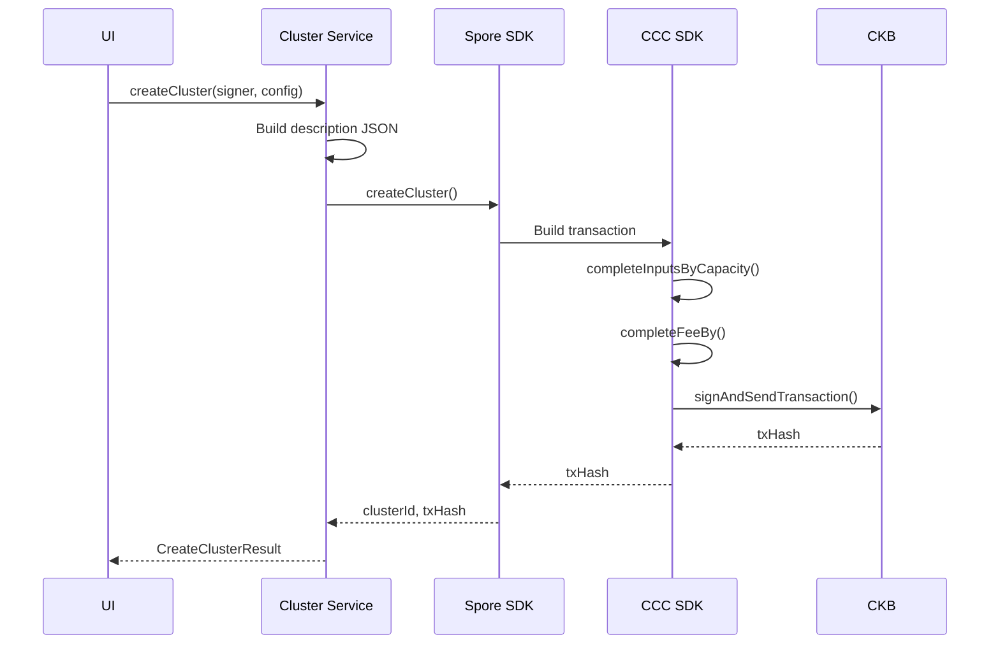

# Cluster Service — Unit Design

## 1. Overview

| Item | Details |
|------|---------|
| **Module** | Cluster Service |
| **File** | `src/lib/credentials/cluster.ts` |
| **Purpose** | Manage Course Provider registration via Spore Clusters |
| **Dependencies** | `@ckb-ccc/spore`, `@ckb-ccc/core` |

---

## 2. Purpose

The Cluster Service handles the creation and management of Spore Clusters, which represent Course Providers in the CKB Credential Registry. Each Cluster is created by a provider and serves as the issuer identity for all certificates they issue.

---

## 3. Public API

### 3.1 Functions

```typescript
// Create a new Cluster for a Course Provider
async function createCluster(params: {
  signer: ccc.Signer;
  config: ClusterConfig;
  creatorAddress?: string;
}): Promise<{ clusterId: string; transactionHash: string }>

// Get all Clusters owned by a provider
async function getProviderClusters(
  address?: string,
  client?: ccc.Client
): Promise<Cluster[]>

// Get a specific Cluster by ID
async function getCluster(clusterId: string): Promise<Cluster | null>
```

### 3.2 Types

```typescript
interface ClusterConfig {
  name: string;
  description: string;
  websiteUrl?: string;
  contactEmail?: string;
  avatarUrl?: string;
  bannerUrl?: string;
}

interface Cluster extends ClusterConfig {
  id: string;
  clusterId: string;
  creatorAddress: string;
  createdAt: string;
  updatedAt?: string;
}

interface ClusterWithCount extends Cluster {
  certificateCount?: number;
}
```

---

## 4. Function Specifications

### 4.1 createCluster

**Purpose**: Create a new Spore Cluster for a Course Provider.

**Parameters**:
| Param | Type | Required | Description |
|-------|------|----------|-------------|
| `signer` | `ccc.Signer` | Yes | Wallet signer for signing transaction |
| `config` | `ClusterConfig` | Yes | Cluster configuration |
| `creatorAddress` | `string` | No | Creator address (derived from signer if not provided) |

**Process**:
1. Get creator address from signer
2. Build cluster metadata JSON from config
3. Call `@ckb-ccc/spore` `createSporeCluster()` to build transaction
4. Complete inputs and fee using `tx.completeInputsByCapacity()` and `tx.completeFeeBy()`
5. Sign and send transaction with `liveSigner.sendTransaction()`
6. Extract clusterId from output

**Returns**: `{ clusterId: string; transactionHash: string }`

**Errors**:
| Error | Condition |
|-------|-----------|
| `INSUFFICIENT_BALANCE` | Not enough CKB (need ~100 CKB for cluster cell). User-friendly message with faucet link. |
| `INVALID_CONFIG` | Invalid cluster configuration |

**Transaction Details**:
```
Input:  Provider's CKB cells
Output: Cluster Cell (Type: Type ID for SporeCluster, Lock: Provider)
Fee:    ~0.001 CKB
```

**Implementation with @ckb-ccc/spore**:
```typescript
import { createSporeCluster } from '@ckb-ccc/spore';

const { tx, id: clusterId } = await createSporeCluster({
  signer: liveSigner,
  data: {
    name: config.name,
    description: JSON.stringify(clusterMetadata),
  },
  to: addrObj.script,
});

await tx.completeInputsByCapacity(liveSigner);
await tx.completeFeeBy(liveSigner, 1000);
const txHash = await liveSigner.sendTransaction(tx);
```

### 4.2 getProviderClusters

**Purpose**: Get all Clusters owned by a provider address.

**Parameters**:
| Param | Type | Required | Description |
|-------|------|----------|-------------|
| `address` | `string` | No | Provider's address |
| `client` | `ccc.Client` | No | CKB client (uses ClientPublicTestnet if not provided) |

**Returns**: `Cluster[]`

**Process**:
1. Load clusters from localStorage (mock storage for MVP)
2. If address provided and real client available:
   - Search for SporeCluster cells owned by the address
   - Scan transactions for Cluster and Certificate cells
3. Filter results by address if provided
4. Return Cluster array

### 4.3 getCluster

**Purpose**: Get a specific Cluster by its ID.

**Parameters**:
| Param | Type | Required | Description |
|-------|------|----------|-------------|
| `clusterId` | `string` | Yes | Cluster ID |

**Returns**: `Cluster | null`

**Process**:
1. Query localStorage for matching clusterId
2. Return Cluster or null if not found

---

## 5. Data Flow



---

## 6. Implementation Notes

### 6.1 Cluster Metadata Structure

The cluster metadata is stored in the SporeCluster cell's description field as a JSON string:

```json
{
  "name": "CKB Academy",
  "description": "Official CKB developer training provider",
  "websiteUrl": "https://ckb.academy",
  "contactEmail": "contact@ckb.academy"
}
```

### 6.2 Cluster ID

Cluster ID = Transaction hash that created the Cluster Cell
- Format: 32-byte hex string (0x...)
- Derived from transaction during creation via `@ckb-ccc/spore`

### 6.3 CCC Spore SDK Integration

The cluster service uses `@ckb-ccc/spore` which is natively integrated with `@ckb-ccc/core`:

```typescript
import { ccc } from '@ckb-ccc/core';
import { createSporeCluster } from '@ckb-ccc/spore';

// Create cluster with live signer
const { tx, id: clusterId } = await createSporeCluster({
  signer: liveSigner,
  data: {
    name: config.name,
    description: JSON.stringify(clusterMetadata),
  },
  to: addrObj.script,
});

await tx.completeInputsByCapacity(liveSigner);
await tx.completeFeeBy(liveSigner, 1000);
const txHash = await liveSigner.sendTransaction(tx);
```

**Benefits of @ckb-ccc/spore over legacy @spore-sdk/core:**
- Native integration with `@ckb-ccc/core` (no separate Lumos dependencies)
- Uses CCC's unified `Transaction` and `Signer` APIs
- No browser `Illegal invocation` errors from `cross-fetch`
- Consistent TypeScript types across the SDK

---

## 7. Testing

### 7.1 Unit Tests

| Test Case | Expected Result |
|-----------|-----------------|
| Create cluster with valid config | Returns clusterId and txHash |
| Create cluster with missing name | Throws INVALID_CONFIG |
| Create cluster with insufficient balance | Throws INSUFFICIENT_BALANCE |
| Get provider clusters | Returns array of clusters |
| Get non-existent cluster | Returns null |

### 7.2 Integration Tests

| Test Case | Expected Result |
|-----------|-----------------|
| Create cluster → Query cluster | Cluster exists on chain |
| Create cluster → Get by ID | Returns correct cluster data |

---

## 8. Related Documents

| Document | Path |
|----------|------|
| Implementation Architecture | `Design_spec/Implementation_Architecture.md` |
| Certificate Service | `Design_spec/03_Certificate_Service.md` |

---

*Version: 2.0*
*Last Updated: 2026-08-29*
