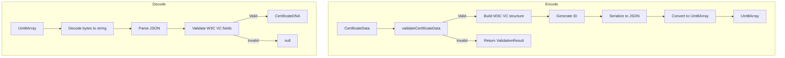

# Certificate Encoder/Decoder — Unit Design

## 1. Overview

| Item | Details |
|------|---------|
| **Module** | Certificate Encoder/Decoder |
| **Files** | `src/lib/credentials/encoder.ts`, `src/lib/credentials/decoder.ts` |
| **Purpose** | Encode/decode certificate data to/from W3C VC JSON format |
| **Dependencies** | None (pure TypeScript) |

---

## 2. Purpose

The Encoder/Decoder module handles the conversion between TypeScript objects and JSON bytes for certificate DNA storage in Spore DOBs. This follows the W3C Verifiable Credentials data model.

---

## 3. Public API

### 3.1 Encoder

```typescript
// Encode certificate data to W3C VC JSON bytes
function encodeCertificateDNA(
  data: CertificateData
): Uint8Array

// Validate certificate data before encoding
function validateCertificateData(
  data: CertificateData
): ValidationResult

// Generate unique certificate ID
function generateCertificateId(): string
```

### 3.2 Decoder

```typescript
// Decode JSON bytes to certificate object
function decodeCertificateDNA(
  data: Uint8Array
): CertificateDNA | null

// Check if certificate is expired
function isExpired(certificate: CertificateDNA): boolean

// Format certificate for display
function formatCertificateDisplay(
  certificate: CertificateDNA
): CertificateDisplay
```

---

## 4. Type Definitions

### 4.1 Input Types

```typescript
interface CertificateData {
  issuer: IssuerInfo;
  recipient: RecipientInfo;
  course: CourseInfo;
  policy?: CertificatePolicy;
  expirationDate?: string;
  metadata?: Record<string, any>;
}

interface IssuerInfo {
  id: string;           // Cluster ID
  name: string;
  description?: string;
}

interface RecipientInfo {
  address: string;       // Wallet address
  name?: string;
}

interface CourseInfo {
  name: string;
  description?: string;
  duration?: string;
  institution?: string;
  completionDate: string;
  grade?: string;
  score?: number;
  skills?: string[];
}

interface CertificatePolicy {
  transferable: boolean;
  allowRenewal: boolean;
}
```

### 4.2 Output Types (W3C VC)

```typescript
interface CertificateDNA {
  "@context": string[];
  id: string;
  type: string[];
  issuer: {
    id: string;
    name: string;
    description?: string;
  };
  issuanceDate: string;
  expirationDate?: string;
  credentialSubject: {
    id: string;
    recipientName?: string;
    courseName: string;
    courseDescription?: string;
    courseDuration?: string;
    courseInstitution?: string;
    completionDate: string;
    grade?: string;
    score?: number;
    skills?: string[];
  };
  credentialStatus?: {
    id: string;
    type: string;
  };
  metadata: {
    clusterId: string;
    templateId?: string;
    version: string;
  };
}

interface ValidationResult {
  valid: boolean;
  errors: string[];
}

interface CertificateDisplay {
  title: string;
  subtitle: string;
  issuer: string;
  date: string;
  status: 'active' | 'expired';
}
```

---

## 5. Function Specifications

### 5.1 encodeCertificateDNA

**Purpose**: Encode certificate data to W3C VC JSON format for Spore DOB storage.

**Parameters**:
| Param | Type | Required | Description |
|-------|------|----------|-------------|
| `data` | `CertificateData` | Yes | Certificate data to encode |

**Returns**: `Uint8Array` (UTF-8 encoded JSON)

**Process**:
1. Generate unique certificate ID
2. Set issuance date to current time
3. Build W3C VC structure
4. Serialize to JSON string
5. Convert to Uint8Array

**Example Output**:
```json
{
  "@context": [
    "https://www.w3.org/2018/credentials/v1",
    "https://credentials.ckb.dob/v1"
  ],
  "id": "did:ckb:credential:abc123",
  "type": ["VerifiableCredential", "CourseCertificate"],
  "issuer": {
    "id": "did:ckb:issuer:cluster:xyz789",
    "name": "CKB Academy"
  },
  "issuanceDate": "2024-01-15T00:00:00.000Z",
  "expirationDate": "2025-01-15T00:00:00.000Z",
  "credentialSubject": {
    "id": "0x1234...",
    "courseName": "CKB Development Fundamentals",
    "completionDate": "2024-01-10",
    "grade": "A",
    "skills": ["Rust", "CKB-VM"]
  },
  "metadata": {
    "clusterId": "0xxyz789...",
    "version": "1.0"
  }
}
```

### 5.2 decodeCertificateDNA

**Purpose**: Decode JSON bytes to CertificateDNA object.

**Parameters**:
| Param | Type | Required | Description |
|-------|------|----------|-------------|
| `data` | `Uint8Array` | Yes | JSON bytes |

**Returns**: `CertificateDNA | null`

**Process**:
1. Decode bytes to string
2. Parse JSON
3. Validate required fields
4. Return CertificateDNA or null

**Error Handling**: Returns null for invalid JSON

### 5.3 isExpired

**Purpose**: Check if certificate has expired.

**Parameters**:
| Param | Type | Required | Description |
|-------|------|----------|-------------|
| `certificate` | `CertificateDNA` | Yes | Certificate to check |

**Returns**: `boolean`

**Logic**:
```typescript
if (!certificate.expirationDate) return false;
return new Date(certificate.expirationDate) < new Date();
```

### 5.4 formatCertificateDisplay

**Purpose**: Format certificate data for UI display.

**Parameters**:
| Param | Type | Required | Description |
|-------|------|----------|-------------|
| `certificate` | `CertificateDNA` | Yes | Certificate to format |

**Returns**: `CertificateDisplay`

```typescript
interface CertificateDisplay {
  title: string;      // Course name
  subtitle: string;   // Institution + date
  issuer: string;     // Issuer name
  date: string;       // Formatted date
  status: 'active' | 'expired' | 'revoked';
}
```

### 5.6 validateCertificateData

**Purpose**: Validate certificate data before encoding.

**Parameters**:
| Param | Type | Required | Description |
|-------|------|----------|-------------|
| `data` | `CertificateData` | Yes | Data to validate |

**Returns**: `ValidationResult`

**Validation Rules**:
| Field | Rule |
|-------|------|
| `issuer.id` | Required, non-empty |
| `issuer.name` | Required, non-empty |
| `recipient.address` | Required, valid CKB address |
| `course.name` | Required, non-empty |
| `course.completionDate` | Required, valid date |
| `expirationDate` | Optional, must be future date if provided |

### 5.7 generateCertificateId

**Purpose**: Generate unique certificate ID for W3C VC `id` field.

> ⚠️ **Important**: This function generates the W3C VC `id` field only.
>
> **Two different IDs in the system:**
> | ID | Source | Purpose |
> |----|--------|---------|
> | **VC `id`** | `generateCertificateId()` | W3C VC identifier (DID format) |
> | **DOB ID** | Spore SDK (transaction output) | Spore cell type script args |

**Returns**: `string`

**Format**: `did:ckb:credential:{timestamp}{randomHex}`

**Example**:
```
did:ckb:credential:1724140800000_a1b2c3d4e5f6
```

**Note**: The actual Spore DOB ID (used for cell lookup) is assigned by the Spore SDK during transaction creation. It is derived from the transaction output and typically follows the pattern `0x{args}` where args come from the Spore protocol.

---

## 6. Data Flow



---

## 7. Constants

```typescript
const W3C_CONTEXT = [
  "https://www.w3.org/2018/credentials/v1",
  "https://credentials.ckb.dob/v1"
];

const CREDENTIAL_TYPE = "CourseCertificate";

const METADATA_VERSION = "1.0";
```

---

## 8. Error Handling

| Error | Condition | Handling |
|-------|-----------|----------|
| Invalid JSON | Cannot parse | Return null |
| Missing required field | Missing W3C fields | Return null |
| Invalid date | Malformed date string | Return null |

---

## 9. Testing

### 9.1 Unit Tests - Encoder

| Test Case | Input | Expected Output |
|-----------|-------|----------------|
| Encode valid data | Complete CertificateData | Valid JSON bytes |
| Encode minimal data | Required fields only | Valid JSON bytes |
| Validate valid data | Complete CertificateData | `{ valid: true, errors: [] }` |
| Validate missing issuer | No issuer.id | `{ valid: false, errors: [...] }` |
| Generate ID | (none) | Unique DID string |

### 9.2 Unit Tests - Decoder

| Test Case | Input | Expected Output |
|-----------|-------|----------------|
| Decode valid JSON | Valid CertificateDNA JSON | CertificateDNA object |
| Decode invalid JSON | Malformed JSON | null |
| Decode empty | Empty bytes | null |
| isExpired - not expired | Future expirationDate | false |
| isExpired - expired | Past expirationDate | true |
| isExpired - no date | No expirationDate | false |
| formatCertificateDisplay | CertificateDNA | CertificateDisplay |

---

## 10. Related Documents

| Document | Path |
|----------|------|
| Implementation Architecture | `Design_spec/Implementation_Architecture.md` |
| Certificate Service | `Design_spec/03_Certificate_Service.md` |
| W3C VC Spec | https://www.w3.org/TR/vc-data-model/ |

---

*Version: 1.0*
*Last Updated: 2026-08-11*
