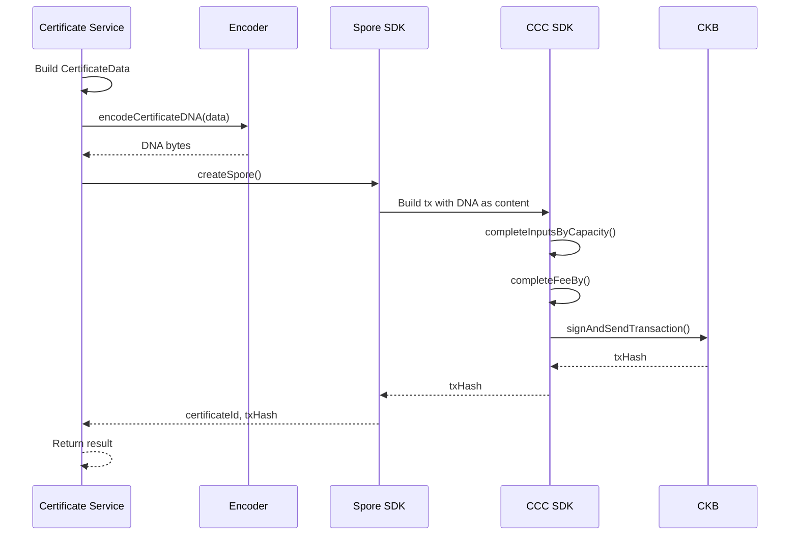
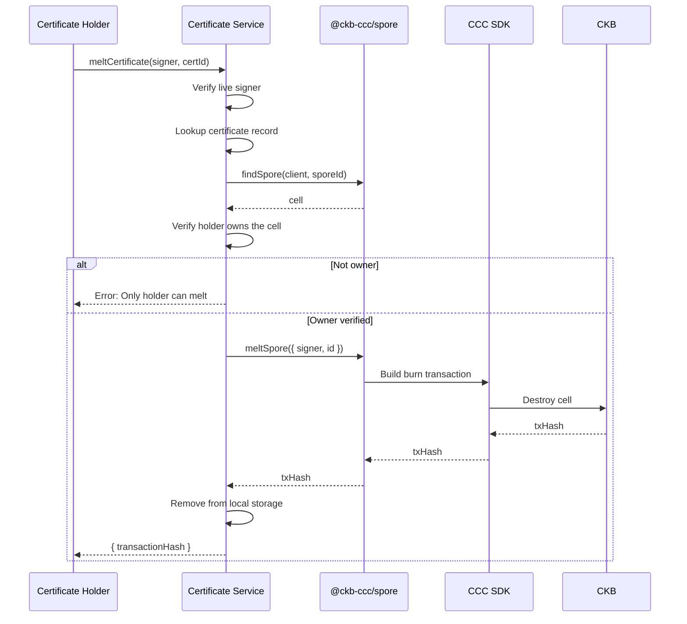
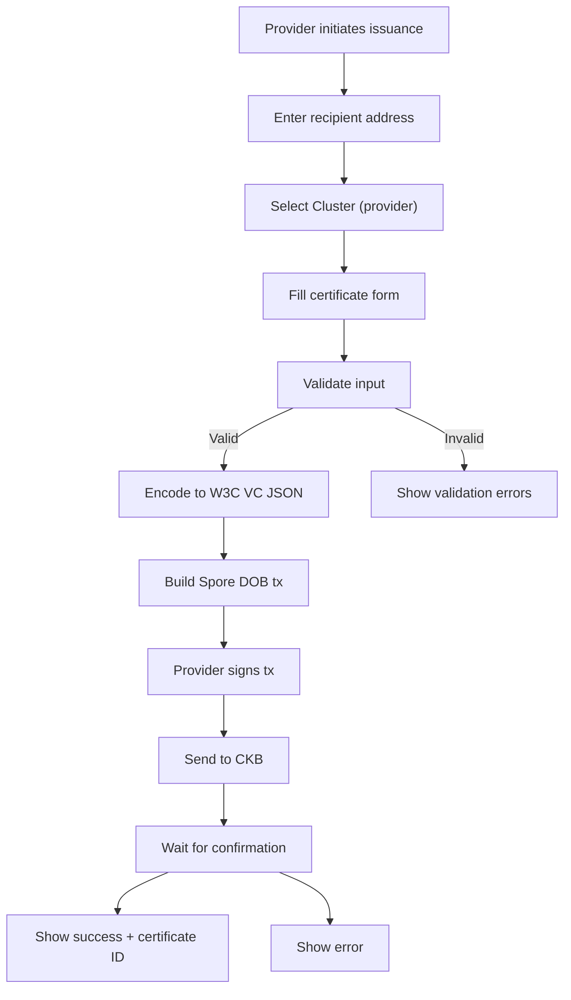
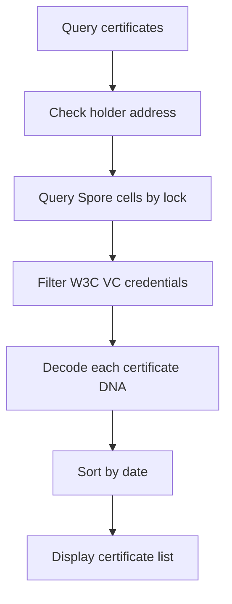

# Certificate Service — Unit Design

## 1. Overview

| Item | Details |
|------|---------|
| **Module** | Certificate Service |
| **File** | `src/lib/credentials/issuer.ts` |
| **Purpose** | Issue and manage course completion certificates |
| **Dependencies** | `@ckb-ccc/spore`, `@ckb-ccc/core`, Encoder/Decoder, `@ckb-ccc/did-ckb` |

---

## 2. Purpose

The Certificate Service handles the issuance and management of course completion certificates as Spore DOBs. It coordinates between the Encoder module and Spore SDK to create, query, and melt certificates. **Supports both CKB wallet addresses and did:ckb: identifiers as recipients.**

---

## 3. Public API

### 3.1 Functions

```typescript
// Issue a single certificate
async function issueCertificate(params: {
  signer: unknown;
  clusterId?: string;
  recipientAddress: string;
  issuerName: string;
  issuerDescription?: string;
  course: CourseInfo;
  expirationDate?: string;
}): Promise<{ certificateId: string; transactionHash: string }>

// Get all certificates owned by a holder
async function getHolderCertificates(
  client?: ccc.Client,
  holderAddress?: string
): Promise<CertificateWithId[]>

// Get certificates under a specific cluster
async function getClusterCertificates(clusterId: string): Promise<GetCertificateResult[]>

// Get all certificates in the system
async function getAllCertificates(client?: ccc.Client, address?: string): Promise<GetCertificateResult[]>

// Get a specific certificate by ID
async function getCertificate(
  certificateId: string,
  client?: ccc.Client
): Promise<CertificateWithId | null>

// Melt (destroy) a certificate to reclaim CKB
async function meltCertificate(
  signer: unknown,
  certificateId: string
): Promise<{ transactionHash: string }>

// Preview exact CKB capacity required to mint a certificate
async function previewCertificateMint(
  signer: unknown,
  params: IssueCertificateParams
): Promise<{
  exactCapacity: number;
  dnaBytes: number;
  sporeId: string;
}>
```

### 3.2 Types

```typescript
interface IssueCertificateParams {
  signer: unknown;  // ccc.Signer in production
  clusterId: string;
  issuerName: string;
  issuerDescription?: string;
  subject: CredentialSubject;
  expirationDate?: string;
}

interface IssueCertificateResult {
  certificateId: string;
  transactionHash: string;
}

interface PreviewCertificateResult {
  exactCapacity: number;
  dnaBytes: number;
  sporeId: string;
}

interface GetCertificateResult {
  certificate: CertificateDNA;
  certificateId: string;
  transactionHash?: string;
  clusterId?: string;
}

interface CertificateDisplay {
  title: string;
  recipient: string;
  course: string;
  issuer: string;
  date?: string;
  status: 'active' | 'expired';
}
```

---

## 4. Function Specifications

### 4.1 issueCertificate

**Purpose**: Issue a course completion certificate to a student.

**Parameters**:
| Param | Type | Required | Description |
|-------|------|----------|-------------|
| `signer` | `ccc.Signer` | Yes | Provider's wallet signer |
| `params` | `IssueCertificateParams` | Yes | Certificate issuance details |

**Process**:


**Returns**: `IssueCertificateResult`

**Transaction Details**:
```
Input:  Provider's CKB cells (for capacity + fee)
Output: Certificate DOB Cell
        - Type: SPORE
        - Lock: Recipient's wallet
        - Data: W3C VC JSON (Certificate DNA)
Fee:    ~0.001 CKB
```

**Errors**:
| Error | Condition |
|-------|-----------|
| `INVALID_ADDRESS` | Invalid recipient address |
| `CLUSTER_NOT_FOUND` | Cluster ID not found |
| `INSUFFICIENT_BALANCE` | Not enough CKB |
| `WALLET_NOT_CONNECTED` | Signer not available |

### 4.2 getHolderCertificates

**Purpose**: Get all certificates owned by a student's wallet.

**Parameters**:
| Param | Type | Required | Description |
|-------|------|----------|-------------|
| `client` | `ccc.Client` | Yes | CKB client |
| `holderLock` | `Script` | Yes | Student's lock script |

**Returns**: `CertificateWithId[]`

**Process**:
1. Query all Spore cells owned by holder
2. Filter for W3C VC credentials (application/json)
3. Decode each cell's DNA
4. Return certificates with IDs

### 4.3 getProviderCertificates

**Purpose**: Get all certificates issued by a provider's Cluster.

**Parameters**:
| Param | Type | Required | Description |
|-------|------|----------|-------------|
| `client` | `ccc.Client` | Yes | CKB client |
| `clusterId` | `string` | Yes | Provider's Cluster ID |

**Returns**: `CertificateWithId[]`

**Note**: This requires tracking issued certificates off-chain or using an indexer that supports cluster queries.

### 4.4 getCertificate

**Purpose**: Get a specific certificate by ID.

**Parameters**:
| Param | Type | Required | Description |
|-------|------|----------|-------------|
| `certificateId` | `string` | Yes | Certificate ID or transaction hash |
| `client` | `ccc.Client` | No | CKB client |

**Returns**: `CertificateWithId | null`

**Process**:
1. Query cell by spore ID or transaction hash
2. Decode W3C VC JSON from cell data
3. Return CertificateWithId or null

### 4.5 meltCertificate

**Purpose**: Destroy a certificate Spore DOB and reclaim the locked CKB capacity. Only the certificate holder can melt their own certificates.

**Parameters**:
| Param | Type | Required | Description |
|-------|------|----------|-------------|
| `signer` | `ccc.Signer` | Yes | Holder's wallet signer (must be live signer) |
| `certificateId` | `string` | Yes | Certificate ID or Spore ID to melt |

**Returns**: `{ transactionHash: string }`

**Process**:


**Transaction Details**:
```
Input:  Certificate DOB Cell (owned by holder)
Output: None (cell destroyed)
Fee:    ~0.001 CKB
Capacity: Reclaimed to holder's wallet
```

**Errors**:
| Error | Condition |
|-------|-----------|
| `LIVE_SIGNER_REQUIRED` | Must use live signer, not mock |
| `CERTIFICATE_NOT_FOUND` | Certificate not found |
| `NOT_HOLDER` | Signer is not the certificate owner |

**Security**:
- Requires live signer (mock signer not accepted)
- Ownership verified by comparing cell lock script with holder's wallet lock script
- Only the certificate holder can destroy their own certificates

### 4.6 previewCertificateMint

**Purpose**: Dry-run minting transaction creation to determine exact CKB capacity required on-chain before user signs.

**Parameters**:
| Param | Type | Required | Description |
|-------|------|----------|-------------|
| `signer` | `ccc.Signer` | Yes | Provider's wallet signer |
| `params` | `IssueCertificateParams` | Yes | Certificate issuance details |

**Returns**: `Promise<{ exactCapacity: number; dnaBytes: number; sporeId: string }>`

**Process**:
1. Resolve recipient address/DID to lock script.
2. Serialize W3C VC certificate DNA to JSON string and measure byte length.
3. Call `spore.createSpore()` with `toLock` set to recipient's lock script to construct the unspent cell output skeleton.
4. Read `outputCell.capacity` directly from the constructed transaction output (converted from shannons to CKB).
5. Return exact required capacity without executing or signing the transaction.

### 4.7 CKB Capacity Calculation Mechanics (RFC 0017 / RFC 0022)

Every cell on Nervos CKB requires sufficient capacity to store its fields ($1\text{ byte} = 1\text{ CKB} = 10^8\text{ shannons}$):

$$\text{Capacity (Bytes)} = 8\text{ (capacity field)} + \text{occupiedSize(lock)} + \text{occupiedSize(type)} + \text{occupiedSize(data)}$$

For a Spore DOB Certificate Cell:
- **Capacity field**: $8\text{ bytes}$
- **Lock script**: Typically $55\text{ bytes}$ (JoyID Omnilock: 32 code_hash + 1 hash_type + 22 args) or $53\text{ bytes}$ (secp256k1: 32 + 1 + 20)
- **Type script (Spore)**: $65\text{ bytes}$ (32 code_hash + 1 hash_type + 32 spore_id args)
- **Data (Molecule SporeData Table)**:
  - Table header overhead: $16\text{ bytes}$ (4 table length + 3 * 4 field offsets)
  - Content type string: $16\text{ bytes}$ (`application/json`)
  - Cluster ID field: $36\text{ bytes}$ (4 offset/length + 32 cluster hash)
  - Content data: $4\text{ bytes}$ vector length + $N\text{ bytes}$ of encoded DNA JSON
  - Fixed SporeData overhead with cluster: $76\text{ bytes}$

$$\text{Total Capacity} = 8 + 55 + 65 + (76 + N_{\text{DNA}}) = \mathbf{204 + N_{\text{DNA}}\text{ CKB}}$$

For a typical certificate DNA payload of $682\text{ bytes}$:
$$\text{Total Capacity} = 204 + 682 = \mathbf{886\text{ CKB}}$$

---

## 5. Data Flow

### 5.1 Certificate Issuance Flow



### 5.2 Certificate Query Flow



---

## 6. Implementation Notes

### 6.1 Spore DOB Creation

```typescript
import { createSpore } from '@ckb-ccc/spore';

const dnaJson = serializeDNA(certificateData);

const { tx, id: sporeId } = await createSpore({
  signer: liveSigner,
  data: {
    contentType: 'application/json',
    content: ccc.bytesFrom(new TextEncoder().encode(dnaJson)),
    clusterId: hasValidCluster ? (clusterId as `0x${string}`) : undefined,
  },
  to: recipientLockScript,
  clusterMode: hasValidCluster ? 'clusterCell' : undefined,
});

await tx.completeInputsByCapacity(liveSigner);
await tx.completeFeeBy(liveSigner, 1000);
const txHash = await liveSigner.sendTransaction(tx);
```

### 6.2 Certificate ID

Certificate ID = Type script args of Spore DOB Cell
- Format: 32-byte hex string (0x...)
- Derived from transaction during creation

### 6.3 Cell Query

```typescript
import { findSpore } from '@ckb-ccc/spore';

// Find certificate by ID
const found = await findSpore(client, sporeId as `0x${string}`);
if (found?.cell) {
  const cellData = new TextDecoder().decode(ccc.bytesFrom(found.cell.outputData));
  const certificate = JSON.parse(cellData);
}
```

### 6.4 Certificate Melting

```typescript
import { meltSpore, findSpore } from '@ckb-ccc/spore';

// Find and verify ownership
const found = await findSpore(client, sporeId);
if (found?.cell) {
  const cellLock = found.cell.cellOutput.lock;
  // Compare with holder's lock script
  const isOwner = cellLock.codeHash === holderLock.codeHash &&
                  cellLock.hashType === holderLock.hashType &&
                  cellLock.args === holderLock.args;
}

// Melt (destroy) the certificate cell
const { tx } = await meltSpore({
  signer: liveSigner,
  id: sporeId as `0x${string}`,
});

await tx.completeInputsByCapacity(liveSigner);
await tx.completeFeeBy(liveSigner, 1000);
const meltTxHash = await liveSigner.sendTransaction(tx);
```

### 6.5 Benefits of @ckb-ccc/spore

- Native integration with `@ckb-ccc/core` (no separate Lumos dependencies)
- Uses CCC's unified `Transaction` and `Signer` APIs
- No browser `Illegal invocation` errors from `cross-fetch`
- Consistent TypeScript types across the SDK
- Support for `createSpore`, `createSporeCluster`, `meltSpore`, `findSpore`, `findCluster`

### 6.6 DID (did:ckb) Support

The certificate service supports issuing certificates to `did:ckb:` identifiers in addition to CKB addresses.

**Resolution Flow:**
```typescript
import { resolveRecipientInput } from "@/lib/did";

// Input: "did:ckb:0123456789abcdef..."
// Output: { targetAddress, targetLock, did, isDid }
const resolved = await resolveRecipientInput(client, didInput);
```

**Backward Compatibility:**
- Certificates issued to CKB addresses continue to work unchanged
- When issuing to a DID, the original wallet address is stored in `credentialSubject.walletAddress`
- Certificate filtering checks both direct address match and DID match

**Benefits:**
- **Portable Identity**: Recipients can change wallets without losing certificates
- **DID Resolution**: Resolves DID to lock script for on-chain cell ownership
- **Vellum Integration**: DID badges link to recipient's Vellum profile

---

## 7. Error Handling

| Error | Condition | User Message |
|-------|-----------|--------------|
| `INVALID_ADDRESS` | Malformed recipient address | "Invalid wallet address" |
| `CLUSTER_NOT_FOUND` | Cluster doesn't exist | "Provider cluster not found" |
| `INSUFFICIENT_BALANCE` | Not enough CKB | "Insufficient CKB balance" |
| `NOT_ISSUER` | Signer not Cluster owner | "You are not the issuer" |
| `LIVE_SIGNER_REQUIRED` | Mock signer used for melt | "Live signer is required to melt a certificate" |
| `CERTIFICATE_NOT_FOUND` | Certificate doesn't exist | "Certificate not found" |
| `NOT_HOLDER` | Signer not certificate owner | "Only the certificate holder can melt this certificate" |
| `INVALID_DID` | Malformed did:ckb: identifier | "Invalid DID format" |
| `DID_NOT_FOUND` | DID not registered on CKB | "DID not found on CKB blockchain" |
| `DID_INACTIVE` | DID has been deactivated | "This DID is no longer active" |

### 7.1 Certificate Lifecycle & Melt as Permanent Deactivation

> **Note**: Instead of soft revocation (marking certificates as revoked in metadata), this system uses **melt certificate** as the permanent deactivation mechanism.
>
> - **Melt Certificate**: Permanently destroys the Spore DOB cell on-chain, reclaiming the locked CKB capacity. The certificate no longer exists on the blockchain and cannot be verified.
> - This approach is more secure than soft revocation because there is no on-chain record to ignore — the certificate is truly gone.
> - The holder controls their own certificates and can melt them at any time.

---

## 8. Testing

### 8.1 Unit Tests

| Test Case | Expected Result |
|-----------|-----------------|
| Issue with valid params | Returns certificateId and txHash |
| Issue with valid DID | Resolves DID and returns certificateId and txHash |
| Issue with invalid address | Throws INVALID_ADDRESS |
| Issue with invalid DID | Throws INVALID_DID / DID_NOT_FOUND |
| Issue with unknown cluster | Throws CLUSTER_NOT_FOUND |
| Get holder certificates | Returns array of certificates |
| Get holder with no certs | Returns empty array |
| Get non-existent cert | Returns null |
| Melt with live signer | Returns transactionHash |
| Melt with mock signer | Throws LIVE_SIGNER_REQUIRED |
| Melt not holder's cert | Throws NOT_HOLDER |

### 8.2 Integration Tests

| Test Case | Expected Result |
|-----------|-----------------|
| Issue → Query by holder | Certificate in results |
| Issue with DID → Query by holder | Certificate matched via DID/address |
| Issue → Get by ID | Correct certificate data |
| Issue → Verify on explorer | Cell exists on chain |
| Melt certificate → Query | Certificate no longer exists |

---

## 9. Related Documents

| Document | Path |
|----------|------|
| Implementation Architecture | `Design_spec/Implementation_Architecture.md` |
| Cluster Service | `Design_spec/01_Cluster_Service.md` |
| Encoder/Decoder | `Design_spec/02_Encoder_Decoder.md` |
| Verification Service | `Design_spec/04_Verification_Service.md` |

---

*Version: 2.1*
*Last Updated: 2026-09-06*
