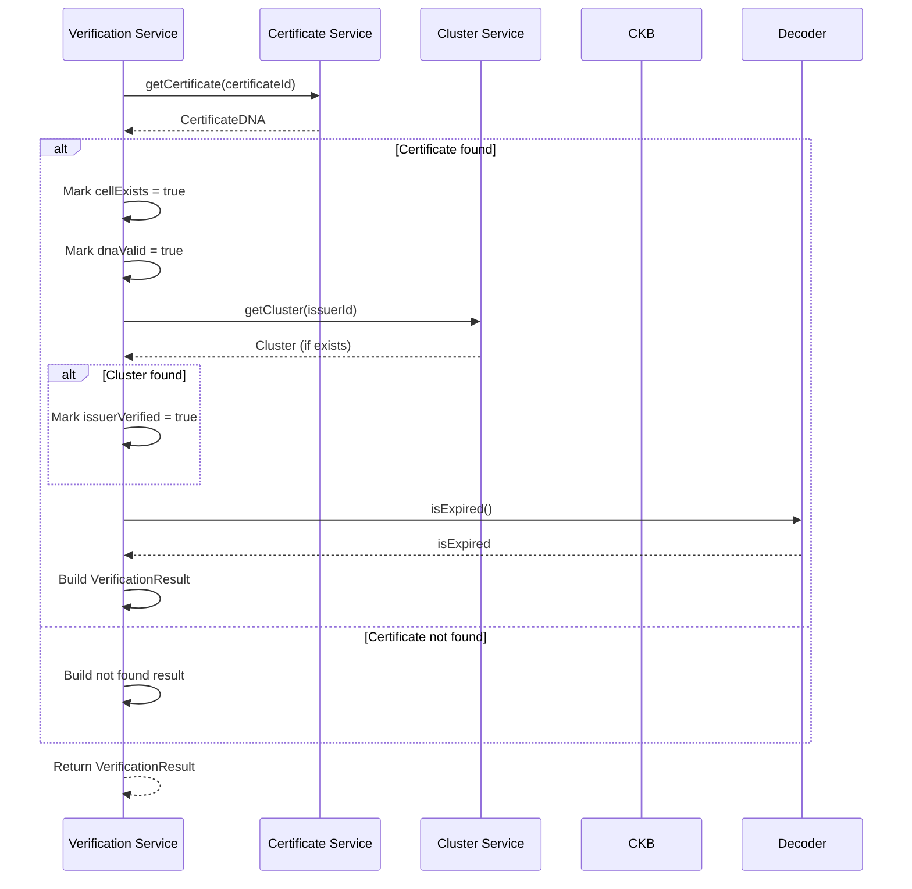
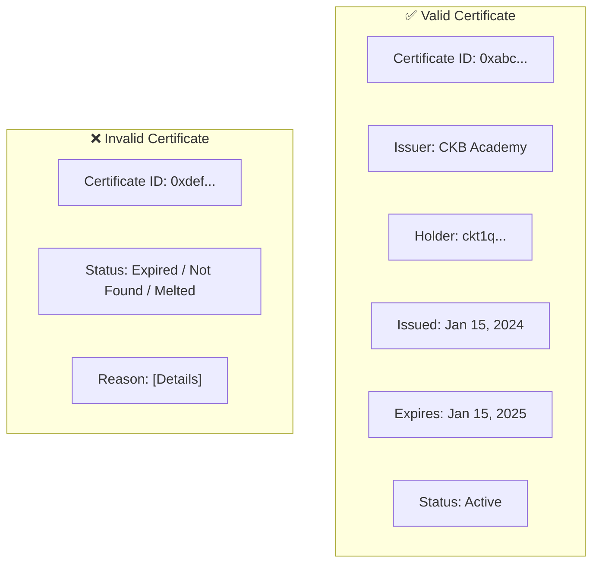

# Verification Service — Unit Design

## 1. Overview

| Item | Details |
|------|---------|
| **Module** | Verification Service |
| **File** | `src/lib/credentials/verifier.ts` |
| **Purpose** | Verify certificate authenticity and status |
| **Dependencies** | `@ckb-ccc/core`, Decoder |

---

## 2. Purpose

The Verification Service provides functionality to verify certificates by querying the CKB blockchain, decoding the certificate DNA, and checking validity and expiration status.

---

## 3. Public API

### 3.1 Functions

```typescript
// Verify a certificate by ID
async function verifyCertificate(
  certificateId: string
): Promise<VerificationResult>

// Get verification history (optional)
async function getVerificationHistory(
  certificateId: string
): Promise<VerificationHistory[]>
```

### 3.2 Types

```typescript
interface VerificationResult {
  valid: boolean;
  certificateId: string;
  issuer: {
    id: string;
    name: string;
  };
  certificate: {
    isExpired: boolean;
    issuanceDate: string;
    expirationDate?: string;
  };
  checks: VerificationChecks;
  errors?: string[];
  timestamp?: string;
  transactionHash?: string;
}

interface VerificationChecks {
  cellExists: boolean;
  dnaValid: boolean;
  issuerVerified: boolean;
  expirationVerified: boolean;
}

interface VerificationHistory {
  certificateId: string;
  verifiedAt: string;
  result: VerificationResult;
}
```

---

## 4. Function Specifications

### 4.1 verifyCertificate

**Purpose**: Verify a certificate's authenticity and status.

**Parameters**:
| Param | Type | Required | Description |
|-------|------|----------|-------------|
| `certificateId` | `string` | Yes | Certificate ID to verify |

**Returns**: `VerificationResult`

**Process**:



**Verification Checks**:

| Check | Description | Pass Condition |
|-------|-------------|----------------|
| `cellExists` | Certificate record found | Record exists |
| `dnaValid` | DNA decodes to valid W3C VC | Decode succeeds |
| `issuerVerified` | Issuer cluster exists | Cluster found |
| `expirationVerified` | Certificate not expired | Not past expirationDate |

**Validity Logic**:
```typescript
const valid =
  checks.cellExists &&
  checks.dnaValid &&
  checks.expirationVerified;
```

### 4.2 getVerificationHistory

**Purpose**: Get historical verification records (optional feature).

**Note**: This requires off-chain storage for verification records.

**Returns**: `VerificationRecord[]`

---

## 5. Verification Result Structure

### 5.1 Valid Certificate

```typescript
{
  valid: true,
  certificateId: "0xabc123...",
  issuer: {
    id: "did:ckb:issuer:cluster:0xyz...",
    name: "CKB Academy",
    clusterVerified: true,
  },
  holder: {
    address: "ckt1q...",
    ownershipVerified: true,
  },
  certificate: {
    type: ["VerifiableCredential", "CourseCertificate"],
    issuanceDate: "2024-01-15T00:00:00Z",
    expirationDate: "2025-01-15T00:00:00Z",
    isExpired: false,
  },
  checks: {
    cellExists: true,
    dnaValid: true,
    issuerVerified: true,
    expirationVerified: true,
  },
  timestamp: "2024-06-01T12:00:00Z",
  transactionHash: "0xdef456...",
}
```

### 5.2 Invalid Certificate (Expired)

```typescript
{
  valid: false,
  certificateId: "0xabc123...",
  // ... other fields
  certificate: {
    // ...
    expirationDate: "2024-01-15T00:00:00Z",
    isExpired: true,
  },
  checks: {
    // ...
    expirationVerified: false,  // FAILED
  },
}
```

### 5.3 Invalid Certificate (Not Found)

```typescript
{
  valid: false,
  certificateId: "0xabc123...",
  issuer: { id: "", name: "", clusterVerified: false },
  holder: { address: "", ownershipVerified: false },
  certificate: {
    type: [],
    issuanceDate: "",
    isExpired: false,
  },
  checks: {
    cellExists: false,  // FAILED
    dnaValid: false,
    issuerVerified: false,
    expirationVerified: false,
  },
  timestamp: "2024-06-01T12:00:00Z",
}
```

---

## 6. UI Display

### 6.1 Verification Result Display



### 6.2 Verification Status Badges

| Status | Badge | Color |
|--------|-------|-------|
| Active | ✅ Valid | Green |
| Expired | ⚠️ Expired | Yellow |
| Melted | ❌ Melted | Red |
| Not Found | ❌ Not Found | Red |

---

## 7. Error Handling

| Error | Condition | Handling |
|-------|-----------|----------|
| Cell not found | Certificate doesn't exist | Return invalid result with cellExists: false |
| Decode failed | Invalid DNA | Return invalid result with dnaValid: false |
| Network error | CKB unreachable | Throw error, let UI handle |

---

## 8. Testing

### 8.1 Unit Tests

| Test Case | Input | Expected Result |
|-----------|-------|----------------|
| Verify valid cert | Existing cert ID | valid: true |
| Verify expired cert | Expired cert ID | valid: false, isExpired: true |
| Verify melted cert | Melted cert ID | valid: false, cellExists: false |
| Verify not found | Non-existent ID | valid: false, cellExists: false |
| Verify with expected issuer | Wrong issuer ID | valid: false, issuerVerified: false |
| Verify with correct issuer | Correct issuer ID | valid: true |
| Verify with checkExpiration=false | Expired cert | valid: true (expiration not checked) |

### 8.2 Integration Tests with Mock CCC SDK

```typescript
describe('Verification Service - Mock CCC SDK', () => {
  const mockClient = {
    findCellsByType: jest.fn(),
  };

  beforeEach(() => {
    jest.clearAllMocks();
  });

  describe('Happy Path', () => {
    it('should verify a valid certificate', async () => {
      const mockCell = createMockSporeCell({
        contentType: 'application/json',
        content: createValidCertificateDNA(),
      });
      mockClient.findCellsByType.mockResolvedValue([mockCell]);

      const result = await verifyCertificate(mockClient, 'cert_123');

      expect(result.valid).toBe(true);
      expect(result.checks.cellExists).toBe(true);
      expect(result.checks.dnaValid).toBe(true);
      expect(result.certificate.isExpired).toBe(false);
    });

    it('should verify expired certificate', async () => {
      const mockCell = createMockSporeCell({
        contentType: 'application/json',
        content: createExpiredCertificateDNA(),
      });
      mockClient.findCellsByType.mockResolvedValue([mockCell]);

      const result = await verifyCertificate(mockClient, 'expired_cert');

      expect(result.valid).toBe(false);
      expect(result.certificate.isExpired).toBe(true);
      expect(result.checks.expirationVerified).toBe(false);
    });

  });

  describe('Edge Cases', () => {
    it('should return invalid for non-existent certificate', async () => {
      mockClient.findCellsByType.mockResolvedValue([]);

      const result = await verifyCertificate(mockClient, 'not_found');

      expect(result.valid).toBe(false);
      expect(result.checks.cellExists).toBe(false);
    });

    it('should return invalid for malformed DNA', async () => {
      const mockCell = createMockSporeCell({
        contentType: 'application/json',
        content: 'not valid json',
      });
      mockClient.findCellsByType.mockResolvedValue([mockCell]);

      const result = await verifyCertificate(mockClient, 'malformed_cert');

      expect(result.valid).toBe(false);
      expect(result.checks.dnaValid).toBe(false);
    });

    it('should verify issuer when expectedIssuerId provided', async () => {
      const mockCell = createMockSporeCell({
        contentType: 'application/json',
        content: createCertificateDNA({ issuerId: 'issuer_abc' }),
      });
      mockClient.findCellsByType.mockResolvedValue([mockCell]);

      const result = await verifyCertificate(mockClient, 'cert_123', {
        expectedIssuerId: 'issuer_abc',
      });

      expect(result.checks.issuerVerified).toBe(true);
    });

    it('should fail issuer verification when ID mismatch', async () => {
      const mockCell = createMockSporeCell({
        contentType: 'application/json',
        content: createCertificateDNA({ issuerId: 'issuer_abc' }),
      });
      mockClient.findCellsByType.mockResolvedValue([mockCell]);

      const result = await verifyCertificate(mockClient, 'cert_123', {
        expectedIssuerId: 'issuer_xyz',
      });

      expect(result.checks.issuerVerified).toBe(false);
      expect(result.valid).toBe(false);
    });
  });
});
```

### 8.3 Integration Tests with OffCKB Devnet

> **Prerequisites**: OffCKB running on localhost:28114, test wallet funded

```typescript
describe('Verification Service - OffCKB Devnet', () => {
  let testnetClient: ccc.Client;
  let testSigner: ccc.Signer;
  let testCluster: Cluster;

  beforeAll(async () => {
    testnetClient = new ccc.ClientPublicTestnet();
    testSigner = await setupTestWallet(testnetClient);

    // Create test cluster
    testCluster = await createCluster(testSigner, {
      name: 'Verification Test Provider',
      description: 'For testing verification service',
    });
  });

  describe('Happy Path', () => {
    it('should issue and then verify certificate', async () => {
      // Issue a certificate
      const issueResult = await issueCertificate(testSigner, {
        clusterId: testCluster.clusterId,
        recipientAddress: await testSigner.getAddress(),
        issuerName: testCluster.name,
        course: {
          name: 'Verification Test Course',
          completionDate: '2026-08-20',
        },
      });

      // Verify the certificate
      const verifyResult = await verifyCertificate(
        testnetClient,
        issueResult.certificateId
      );

      expect(verifyResult.valid).toBe(true);
      expect(verifyResult.certificateId).toBe(issueResult.certificateId);
      expect(verifyResult.checks.cellExists).toBe(true);
    });

    it('should return invalid for certificate from unknown cluster', async () => {
      const verifyResult = await verifyCertificate(
        testnetClient,
        '0x0000000000000000000000000000000000000000000000000000000000000000'
      );

      expect(verifyResult.valid).toBe(false);
      expect(verifyResult.checks.cellExists).toBe(false);
    });
  });

  describe('Expiration Scenarios', () => {
    it('should detect expired certificate', async () => {
      // Issue certificate with past expiration date
      const issueResult = await issueCertificate(testSigner, {
        clusterId: testCluster.clusterId,
        recipientAddress: await testSigner.getAddress(),
        issuerName: testCluster.name,
        course: { name: 'Expired Course', completionDate: '2024-01-01' },
        expirationDate: '2024-01-15T00:00:00Z', // Already expired
      });

      const verifyResult = await verifyCertificate(
        testnetClient,
        issueResult.certificateId
      );

      expect(verifyResult.valid).toBe(false);
      expect(verifyResult.certificate.isExpired).toBe(true);
    });

    it('should verify certificate without expiration date', async () => {
      // Issue certificate without expiration
      const issueResult = await issueCertificate(testSigner, {
        clusterId: testCluster.clusterId,
        recipientAddress: await testSigner.getAddress(),
        issuerName: testCluster.name,
        course: { name: 'No Expiry Course', completionDate: '2026-08-20' },
        // No expirationDate
      });

      const verifyResult = await verifyCertificate(
        testnetClient,
        issueResult.certificateId
      );

      expect(verifyResult.valid).toBe(true);
      expect(verifyResult.certificate.expirationDate).toBeUndefined();
    });
  });

  describe('Melt Certificate Scenarios', () => {
    it('should return not found for melted certificate', async () => {
      // Issue certificate
      const issueResult = await issueCertificate(testSigner, {
        clusterId: testCluster.clusterId,
        recipientAddress: await testSigner.getAddress(),
        issuerName: testCluster.name,
        course: { name: 'Melted Course', completionDate: '2026-08-20' },
      });

      // Melt it
      await meltCertificate(testSigner, issueResult.certificateId);

      // Verify - should be invalid due to cell no longer existing
      const verifyResult = await verifyCertificate(
        testnetClient,
        issueResult.certificateId
      );

      expect(verifyResult.valid).toBe(false);
      expect(verifyResult.checks.cellExists).toBe(false);
    });
  });
});
```

### 8.4 Verification Checks Matrix

| Check | Test Case | Expected Result |
|-------|-----------|----------------|
| cellExists | Valid certificate ID | true |
| cellExists | Invalid/non-existent ID | false |
| dnaValid | Valid W3C VC JSON | true |
| dnaValid | Malformed JSON | false |
| dnaValid | Missing required fields | false |
| issuerVerified | Expected issuer matches | true |
| issuerVerified | Expected issuer differs | false |
| issuerVerified | No expected issuer provided | true (skipped) |
| expirationVerified | No expiration date | true (N/A) |
| expirationVerified | Future expiration date | true |
| expirationVerified | Past expiration date | false |

### 8.5 Melt Certificate (Permanent Deactivation)

> Instead of revocation, the system uses **melt certificate** as permanent deactivation. A melted certificate no longer exists on-chain, so verification will return `valid: false` with `cellExists: false`.

---

## 9. Related Documents

| Document | Path |
|----------|------|
| Implementation Architecture | `Design_spec/Implementation_Architecture.md` |
| Certificate Service | `Design_spec/03_Certificate_Service.md` |
| Encoder/Decoder | `Design_spec/02_Encoder_Decoder.md` |

---

*Version: 2.0*
*Last Updated: 2026-08-29*
