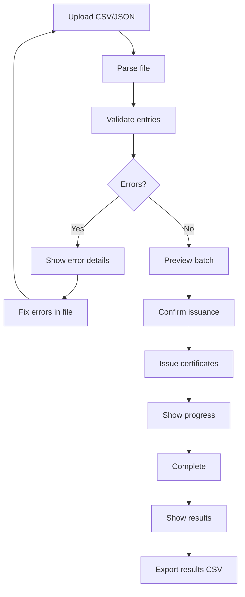

# Batch Issuance — Unit Design

## 1. Overview

| Item | Details |
|------|---------|
| **Module** | Batch Issuance |
| **File** | `src/lib/credentials/batch.ts` |
| **Purpose** | Issue multiple certificates in one operation |
| **Dependencies** | Certificate Service, Encoder/Decoder |

---

## 2. Purpose

The Batch Issuance module allows Course Providers to issue multiple certificates at once by uploading a CSV or JSON file containing recipient information.

---

## 3. Public API

### 3.1 Functions

```typescript
// Parse batch file (CSV or JSON)
function parseBatchFile(
  file: File
): Promise<ParseBatchResult>

// Validate batch entries
function validateBatchEntries(
  entries: BatchEntry[],
  template?: Template
): ValidationResult

// Issue batch certificates
async function issueBatchCertificates(
  signer: ccc.Signer,
  params: BatchIssueParams
): Promise<BatchIssueResult>

// Preview batch before issuing
function previewBatch(
  entries: BatchEntry[],
  clusterId: string
): BatchPreview
```

### 3.2 Types

```typescript
interface BatchEntry {
  row: number;
  recipientAddress: string;
  recipientName?: string;
  courseName: string;
  completionDate: string;
  grade?: string;
  score?: number;
  skills?: string[];
  metadata?: Record<string, any>;
  errors?: string[];
  valid: boolean;
}

interface ParseBatchResult {
  entries: BatchEntry[];
  totalRows: number;
  validCount: number;
  invalidCount: number;
}

interface BatchIssueParams {
  clusterId: string;
  issuerName: string;
  issuerDescription?: string;
  entries: BatchEntry[];
  expirationDate?: string;
  templateId?: string;
  onProgress?: (progress: BatchProgress) => void;
}

interface BatchProgress {
  current: number;
  total: number;
  currentAddress: string;
  status: 'encoding' | 'building' | 'signing' | 'sending';
}

interface BatchIssueResult {
  total: number;
  successful: number;
  failed: number;
  certificates: BatchCertificateResult[];
  errors: BatchError[];
}

interface BatchCertificateResult {
  row: number;
  recipientAddress: string;
  certificateId?: string;
  transactionHash?: string;
  success: boolean;
  error?: string;
}

interface BatchPreview {
  totalEntries: number;
  validEntries: BatchEntry[];
  invalidEntries: BatchEntry[];
  estimatedFee: string;
  warnings: string[];
}
```

---

## 4. Function Specifications

### 4.1 parseBatchFile

**Purpose**: Parse CSV or JSON file containing batch recipient data.

**Parameters**:
| Param | Type | Required | Description |
|-------|------|----------|-------------|
| `file` | `File` | Yes | CSV or JSON file |

**Returns**: `ParseBatchResult`

**Supported Formats**:

**CSV Format**:
```csv
recipientAddress,recipientName,courseName,completionDate,grade,skills
ckt1q...123,John Doe,CKB Basics,2024-01-15,A,Rust;CKB-VM
ckt1q...456,Jane Smith,CKB Basics,2024-01-16,B+,CKB-VM
```

**JSON Format**:
```json
[
  {
    "recipientAddress": "ckt1q...123",
    "recipientName": "John Doe",
    "courseName": "CKB Basics",
    "completionDate": "2024-01-15",
    "grade": "A",
    "skills": ["Rust", "CKB-VM"]
  }
]
```

### 4.2 validateBatchEntries

**Purpose**: Validate all batch entries before issuance.

**Returns**: `ValidationResult`

**Validation Rules**:
| Check | Rule |
|-------|------|
| Address format | Valid CKB address |
| Date format | Valid ISO date |
| Required fields | All required fields present |

### 4.3 previewBatch

**Purpose**: Preview batch before issuing.

**Returns**: `BatchPreview`

### 4.4 issueBatchCertificates

**Purpose**: Issue certificates for all valid entries.

> **Transaction Strategy**:
>
> | Phase | Approach | Description |
> |-------|----------|-------------|
> | **MVP** | N individual transactions | One transaction per certificate. Simple but higher total fees. |
> | **Phase 2** | 1 transaction with N outputs | Efficient batching. Lower fees but more complex. |

**Parameters**:
| Param | Type | Required | Description |
|-------|------|----------|-------------|
| `signer` | `ccc.Signer` | Yes | Provider's wallet |
| `params` | `BatchIssueParams` | Yes | Batch issuance parameters |

**Returns**: `Promise<BatchIssueResult>`

**MVP Implementation**:
```typescript
async function issueBatchCertificates(
  signer: ccc.Signer,
  params: BatchIssueParams
): Promise<BatchIssueResult> {
  const results: BatchCertificateResult[] = [];
  const errors: BatchError[] = [];

  for (let i = 0; i < params.entries.length; i++) {
    const entry = params.entries[i];
    if (!entry.valid) continue;

    // Report progress
    params.onProgress?.({
      current: i + 1,
      total: params.entries.length,
      currentAddress: entry.recipientAddress,
      status: 'encoding',
    });

    try {
      // Issue one certificate at a time
      const result = await issueCertificate(signer, {
        clusterId: params.clusterId,
        recipientAddress: entry.recipientAddress,
        issuerName: params.issuerName,
        // ... other params
      });

      results.push({
        row: entry.row,
        recipientAddress: entry.recipientAddress,
        certificateId: result.certificateId,
        transactionHash: result.transactionHash,
        success: true,
      });
    } catch (error) {
      results.push({
        row: entry.row,
        recipientAddress: entry.recipientAddress,
        success: false,
        error: error.message,
      });
      errors.push({
        row: entry.row,
        error: error.message,
      });
    }
  }

  return {
    total: params.entries.length,
    successful: results.filter(r => r.success).length,
    failed: results.filter(r => !r.success).length,
    certificates: results,
    errors,
  };
}
```

**Phase 2: Batch Transaction**:
```typescript
// Future: One transaction with N outputs
async function issueBatchCertificatesV2(
  signer: ccc.Signer,
  params: BatchIssueParams
): Promise<BatchIssueResult> {
  // 1. Build N cell outputs (one per certificate)
  // 2. Create single transaction with all outputs
  // 3. Sign and send once
  // 4. Lower total fees due to shared witness data
}
```

---

## 5. Batch Processing Flow



---

## 6. UI Components

### 6.1 Batch Upload Component

```
┌─────────────────────────────────────────────┐
│  Batch Certificate Issuance                │
├─────────────────────────────────────────────┤
│  1. Upload File                             │
│  ┌─────────────────────────────────────┐   │
│  │  Drop CSV or JSON file here          │   │
│  │  or click to browse                  │   │
│  └─────────────────────────────────────┘   │
│                                             │
│  2. Preview (3 entries)                   │
│  ┌─────────────────────────────────────┐   │
│  │ Address         │ Name    │ Course   │   │
│  │ ckt1q...123    │ John    │ CKB 101  │   │
│  │ ckt1q...456    │ Jane    │ CKB 101  │   │
│  │ ckt1q...789    │ Bob     │ CKB 101  │   │
│  └─────────────────────────────────────┘   │
│                                             │
│  [Cancel]                    [Issue 3]     │
└─────────────────────────────────────────────┘
```

### 6.2 Progress Display

```
┌─────────────────────────────────────────────┐
│  Issuing Certificates...                   │
├─────────────────────────────────────────────┤
│  ████████████░░░░░░░░░  12/50            │
│                                             │
│  Current: ckt1q...abc                      │
│  Status: Encoding...                        │
│                                             │
│  Completed: 12                             │
│  Failed: 0                                  │
└─────────────────────────────────────────────┘
```

---

## 7. Error Handling

### 7.1 Parse Errors

| Error | Description |
|-------|-------------|
| `INVALID_FILE_TYPE` | Not CSV or JSON |
| `EMPTY_FILE` | File has no data |
| `PARSING_ERROR` | Malformed file structure |

### 7.2 Validation Errors

| Error | Description |
|-------|-------------|
| `INVALID_ADDRESS` | Malformed wallet address |
| `INVALID_DATE` | Invalid date format |
| `MISSING_FIELD` | Required field empty |

### 7.3 Issuance Errors

| Error | Description |
|-------|-------------|
| `INSUFFICIENT_BALANCE` | Not enough CKB for batch |
| `TRANSACTION_FAILED` | CKB transaction failed |

---

## 8. Performance Considerations

### 8.1 Batch Size Limits

| Batch Size | Recommended | Max |
|------------|-------------|-----|
| MVP | 10-50 | 100 |

### 8.2 Estimated Costs

```
Per Certificate:
- Capacity: ~150 CKB (Spore DOB)
- Fee: ~0.001 CKB
- Total: ~151 CKB per certificate

For 100 certificates:
- Total CKB: ~15,100 CKB
```

---

## 9. Testing

### 9.1 Unit Tests

| Test Case | Input | Expected Result |
|-----------|-------|-----------------|
| Parse valid CSV | 10 entries | 10 BatchEntry objects |
| Parse valid JSON | 10 entries | 10 BatchEntry objects |
| Parse CSV with headers | CSV with header row | Skip header, parse data |
| Parse CSV with empty rows | CSV with blank lines | Skip empty rows |
| Parse invalid file type | .txt file | Throws INVALID_FILE_TYPE |
| Parse empty file | 0 bytes | Throws EMPTY_FILE |
| Parse malformed CSV | Missing columns | Throws PARSING_ERROR |
| Parse malformed JSON | Invalid JSON | Throws PARSING_ERROR |
| Validate valid entries | All valid addresses | `{ valid: true }` |
| Validate invalid addresses | ckt1q...xyz | Marked invalid |
| Validate missing required fields | No courseName | Marked invalid |
| Validate invalid date format | "not-a-date" | Marked invalid |
| Preview batch - all valid | 10 valid entries | Show 10 entries |
| Preview batch - mixed | 8 valid, 2 invalid | Show 8 valid, 2 errors |

### 9.2 Integration Tests with Mock Spore SDK

```typescript
describe('Batch Issuance - Mock Spore SDK', () => {
  const mockSporeSdk = {
    createSpore: jest.fn().mockResolvedValue({
      txSkeleton: mockTxSkeleton,
      outputIndex: 0,
      clusterId: 'mock-cluster-id',
    }),
  };

  it('should issue 5 certificates successfully', async () => {
    const entries = generateEntries(5);
    const result = await issueBatchCertificates(signer, {
      clusterId: 'cluster_abc',
      issuerName: 'Test Issuer',
      entries,
    });

    expect(result.successful).toBe(5);
    expect(result.failed).toBe(0);
    expect(mockSporeSdk.createSpore).toHaveBeenCalledTimes(5);
  });

  it('should continue issuing when one fails', async () => {
    mockSporeSdk.createSpore
      .mockResolvedValueOnce({ /* success */ })
      .mockRejectedValueOnce(new Error('Network error'))
      .mockResolvedValueOnce({ /* success */ });

    const entries = generateEntries(3);
    const result = await issueBatchCertificates(signer, { entries });

    expect(result.successful).toBe(2);
    expect(result.failed).toBe(1);
  });
});
```

### 9.3 Integration Tests with Local Devnet (OffCKB)

> **Prerequisites**: OffCKB running on localhost:28114

```typescript
describe('Batch Issuance - OffCKB Devnet', () => {
  let testnetSigner: ccc.Signer;
  let testnetClient: ccc.Client;

  beforeAll(async () => {
    // Setup OffCKB connection
    testnetClient = new ccc.ClientPublicTestnet();
    testnetSigner = await setupTestWallet(testnetClient);
  });

  describe('Happy Path', () => {
    it('should issue 10 certificates in batch', async () => {
      // Create test cluster
      const cluster = await createCluster(testnetSigner, {
        name: 'Test Batch Cluster',
        description: 'Batch test provider',
      });

      // Generate 10 test entries
      const entries = Array.from({ length: 10 }, (_, i) => ({
        row: i + 1,
        recipientAddress: generateTestAddress(i),
        recipientName: `Student ${i + 1}`,
        courseName: 'Test Course',
        completionDate: '2026-08-20',
        grade: 'A',
        valid: true,
      }));

      const result = await issueBatchCertificates(testnetSigner, {
        clusterId: cluster.clusterId,
        issuerName: 'Test Issuer',
        entries,
      });

      expect(result.successful).toBe(10);
      expect(result.failed).toBe(0);

      // Verify all certificates on chain
      for (const cert of result.certificates) {
        const onChain = await getCertificate(testnetClient, cert.certificateId!);
        expect(onChain).not.toBeNull();
      }
    });
  });

  describe('Edge Cases', () => {
    it('should handle insufficient balance', async () => {
      const poorSigner = await createPoorTestWallet(testnetClient);

      const entries = generateEntries(1);
      const result = await issueBatchCertificates(poorSigner, { entries });

      expect(result.successful).toBe(0);
      expect(result.failed).toBe(1);
      expect(result.errors[0].error).toContain('INSUFFICIENT_BALANCE');
    });

    it('should handle network timeout gracefully', async () => {
      // Mock network failure
      const flakyClient = createFlakyClient(testnetClient);

      const entries = generateEntries(3);
      const result = await issueBatchCertificates(flakySigner, { entries });

      // Should report failures without crashing
      expect(result.failed).toBeGreaterThan(0);
    });

    it('should handle invalid recipient address', async () => {
      const entries = [
        {
          row: 1,
          recipientAddress: 'invalid_address',
          courseName: 'Test',
          completionDate: '2026-08-20',
          valid: false,
          errors: ['Invalid address format'],
        },
      ];

      const result = await issueBatchCertificates(testnetSigner, { entries });

      expect(result.successful).toBe(0);
      expect(result.certificates[0].success).toBe(false);
    });
  });
});
```

### 9.4 Performance Tests

```typescript
describe('Batch Issuance - Performance', () => {
  it('should handle 50 certificates within 5 minutes', async () => {
    const entries = generateEntries(50);

    const start = Date.now();
    const result = await issueBatchCertificates(testnetSigner, { entries });
    const duration = Date.now() - start;

    expect(result.successful).toBe(50);
    expect(duration).toBeLessThan(5 * 60 * 1000); // 5 minutes
  });

  it('should estimate fees correctly', async () => {
    const preview = previewBatch(generateEntries(100), 'cluster_abc');

    // 100 certs * ~151 CKB = ~15100 CKB
    const estimated = parseFloat(preview.estimatedFee);
    expect(estimated).toBeGreaterThan(15000);
    expect(estimated).toBeLessThan(20000);
  });
});
```

---

## 10. Related Documents

| Document | Path |
|----------|------|
| Implementation Architecture | `Design_spec/Implementation_Architecture.md` |
| Certificate Service | `Design_spec/03_Certificate_Service.md` |
| Template Service | `Design_spec/05_Template_Service.md` |

---

*Version: 1.0*
*Last Updated: 2026-08-11*
