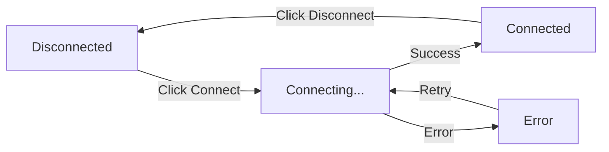

# UI Components — Unit Design

## 1. Overview

| Item | Details |
|------|---------|
| **Module** | UI Components |
| **Files** | `src/components/**/*.tsx` |
| **Purpose** | Reusable React components for the credential registry |
| **Dependencies** | React, Tailwind CSS |

---

## 2. Component Structure

```
src/components/
├── ui/
│   ├── Button.tsx
│   ├── Card.tsx
│   ├── Input.tsx
│   ├── Modal.tsx
│   ├── Select.tsx
│   ├── Textarea.tsx
│   ├── Badge.tsx
│   ├── Spinner.tsx
│   └── EmptyState.tsx
├── wallet/
│   └── WalletConnect.tsx
├── cluster/
│   ├── ClusterCard.tsx
│   ├── ClusterForm.tsx
│   └── ClusterList.tsx
├── certificate/
│   ├── CertificateCard.tsx
│   ├── CertificateDetail.tsx
│   ├── CertificateForm.tsx
│   └── CertificateList.tsx
├── template/
│   ├── TemplateCard.tsx
│   └── TemplateForm.tsx
├── verification/
│   ├── VerifyForm.tsx
│   └── VerifyResult.tsx
└── batch/
    ├── BatchUpload.tsx
    └── BatchPreview.tsx
```

---

## 3. UI Primitives

### 3.1 Button

**Props**:
```typescript
interface ButtonProps {
  variant?: 'primary' | 'secondary' | 'danger' | 'ghost';
  size?: 'sm' | 'md' | 'lg';
  disabled?: boolean;
  loading?: boolean;
  fullWidth?: boolean;
  children: React.ReactNode;
  onClick?: () => void;
  type?: 'button' | 'submit' | 'reset';
}
```

**Variants**:
| Variant | Use Case |
|---------|----------|
| `primary` | Main actions (Issue, Create) |
| `secondary` | Secondary actions (Cancel, Back) |
| `danger` | Destructive actions (Revoke, Delete) |
| `ghost` | Tertiary actions (Copy, View) |

### 3.2 Card

**Props**:
```typescript
interface CardProps {
  variant?: 'default' | 'highlighted' | 'interactive';
  padding?: 'none' | 'sm' | 'md' | 'lg';
  children: React.ReactNode;
  onClick?: () => void;
  className?: string;
}
```

### 3.3 Input

**Props**:
```typescript
interface InputProps {
  label?: string;
  error?: string;
  helperText?: string;
  placeholder?: string;
  type?: 'text' | 'number' | 'date' | 'email';
  value: string;
  onChange: (value: string) => void;
  disabled?: boolean;
  required?: boolean;
}
```

### 3.4 Badge

**Props**:
```typescript
interface BadgeProps {
  variant?: 'success' | 'warning' | 'danger' | 'info' | 'neutral';
  children: React.ReactNode;
}
```

**Variants**:
| Variant | Color | Use Case |
|---------|-------|----------|
| `success` | Green | Active, Valid |
| `warning` | Yellow | Expiring, Pending |
| `danger` | Red | Expired, Revoked, Error |
| `info` | Blue | Informational |
| `neutral` | Gray | Default |

### 3.5 Spinner

**Props**:
```typescript
interface SpinnerProps {
  size?: 'sm' | 'md' | 'lg';
  label?: string;
}
```

### 3.6 EmptyState

**Props**:
```typescript
interface EmptyStateProps {
  icon?: string;
  title: string;
  description?: string;
  action?: {
    label: string;
    onClick: () => void;
  };
}
```

---

## 4. Wallet Components

### 4.1 WalletConnect

**Purpose**: Connect wallet and display connection status.

**States**:


**UI Layout**:
```
┌─────────────────────────────────────────────────────────┐
│  [WalletIcon]  ckt1q...xyz123          [Disconnect]   │
│                Balance: 1000 CKB                       │
└─────────────────────────────────────────────────────────┘
```

**Props**:
```typescript
interface WalletConnectProps {
  onConnect?: (signer: ccc.Signer) => void;
  onDisconnect?: () => void;
  showBalance?: boolean;
}
```

---

## 5. Cluster Components

### 5.1 ClusterCard

**Purpose**: Display cluster summary in a card.

**Layout**:
```
┌─────────────────────────────────────────────────────────┐
│  📜 CKB Academy                                         │
│  Course certificate provider                             │
│                                                         │
│  Certificates Issued: 42                               │
│  Created: Jan 15, 2024                                  │
│                                                         │
│  [Manage]  [Issue Certificate]                         │
└─────────────────────────────────────────────────────────┘
```

**Props**:
```typescript
interface ClusterCardProps {
  cluster: Cluster;
  certificateCount?: number;
  onManage?: () => void;
  onIssue?: () => void;
}
```

### 5.2 ClusterForm

**Purpose**: Form to create/edit a cluster.

**Fields**:
| Field | Type | Required | Validation |
|-------|------|----------|------------|
| Name | text | Yes | 1-100 chars |
| Description | textarea | Yes | 1-500 chars |
| Website URL | text | No | Valid URL |
| Contact Email | email | No | Valid email |

**Props**:
```typescript
interface ClusterFormProps {
  initialValues?: Partial<ClusterConfig>;
  onSubmit: (data: ClusterConfig) => void;
  onCancel?: () => void;
  loading?: boolean;
}
```

---

## 6. Certificate Components

### 6.1 CertificateCard

**Purpose**: Display certificate summary in a card.

**Layout**:
```
┌─────────────────────────────────────────────────────────┐
│  🎓 CKB Development Fundamentals                        │
│  CKB Academy • Completed Jan 15, 2024                  │
│                                                         │
│  Grade: A    Skills: Rust, CKB-VM                    │
│                                                         │
│  [Valid ✅]                      [View Details]        │
└─────────────────────────────────────────────────────────┘
```

**Props**:
```typescript
interface CertificateCardProps {
  certificate: CertificateDNA;
  certificateId: string;
  status?: 'active' | 'expired';
  onClick?: () => void;
  onShare?: () => void;
}
```

### 6.2 CertificateDetail

**Purpose**: Display full certificate details.

**Layout**:
```
┌─────────────────────────────────────────────────────────┐
│                        CERTIFICATE                       │
│                    🎓 Verified                          │
│                                                         │
│  ┌─────────────────────────────────────────────────┐  │
│  │  CKB Development Fundamentals                     │  │
│  │  CKB Academy                                     │  │
│  │  Completed: January 15, 2024                     │  │
│  │  Grade: A                                       │  │
│  │  Skills: Rust, CKB-VM, Cell Model              │  │
│  └─────────────────────────────────────────────────┘  │
│                                                         │
│  Issuer: CKB Academy                                  │
│  Issued: Jan 15, 2024                                 │
│  Expires: Jan 15, 2025 (if set)                      │
│                                                         │
│  [Copy ID]  [Open in Explorer]  [Share]             │
└─────────────────────────────────────────────────────────┘
```

**Props**:
```typescript
interface CertificateDetailProps {
  certificate: CertificateDNA;
  certificateId: string;
  transactionHash?: string;
  onCopyId?: () => void;
  onOpenExplorer?: () => void;
  onShare?: () => void;
}
```

### 6.3 CertificateForm

**Purpose**: Form to issue a new certificate.

**Fields**:
| Field | Type | Required | Source |
|-------|------|----------|--------|
| Recipient Address | text | Yes | User input |
| Course Name | text | Yes | Template/input |
| Completion Date | date | Yes | Template/input |
| Grade | select | No | Template |
| Skills | text | No | Template |

**Props**:
```typescript
interface CertificateFormProps {
  clusterId: string;
  template?: Template;
  onSubmit: (data: CertificateData) => void;
  onCancel?: () => void;
  loading?: boolean;
}
```

---

## 7. Verification Components

### 7.1 VerifyForm

**Purpose**: Form to input certificate ID for verification.

**Layout**:
```
┌─────────────────────────────────────────────────────────┐
│  Verify Certificate                                    │
│                                                         │
│  ┌─────────────────────────────────────────────────┐  │
│  │  Enter Certificate ID                          │  │
│  └─────────────────────────────────────────────────┘  │
│                                                         │
│  [Verify]                                              │
└─────────────────────────────────────────────────────────┘
```

**Props**:
```typescript
interface VerifyFormProps {
  onVerify: (certificateId: string) => void;
  loading?: boolean;
}
```

### 7.2 VerifyResult

**Purpose**: Display verification result.

**States**:

**Valid Certificate**:
```
┌─────────────────────────────────────────────────────────┐
│                    ✅ Valid Certificate                 │
│                                                         │
│  Certificate ID: 0xabc...123                           │
│  Issuer: CKB Academy                                   │
│  Type: Course Certificate                              │
│  Issued: Jan 15, 2024                                │
│  Status: Active                                       │
│                                                         │
│  [View Details]                                       │
└─────────────────────────────────────────────────────────┘
```

**Invalid Certificate (Expired)**:
```
┌─────────────────────────────────────────────────────────┐
│                    ⚠️ Expired Certificate                │
│                                                         │
│  Certificate ID: 0xdef...456                           │
│  Expired: Jan 15, 2024                               │
│                                                         │
│  [View Details]                                       │
└─────────────────────────────────────────────────────────┘
```

**Not Found**:
```
┌─────────────────────────────────────────────────────────┐
│                    ❌ Certificate Not Found            │
│                                                         │
│  No certificate found with ID: 0x123...               │
└─────────────────────────────────────────────────────────┘
```

**Props**:
```typescript
interface VerifyResultProps {
  result: VerificationResult;
  onViewDetails?: () => void;
}
```

---

## 8. Batch Components

### 8.1 BatchUpload

**Purpose**: Upload CSV/JSON file for batch issuance.

**Layout**:
```
┌─────────────────────────────────────────────────────────┐
│  Batch Certificate Issuance                            │
│                                                         │
│  ┌─────────────────────────────────────────────────┐  │
│  │                                                   │  │
│  │           📁 Drop file here                      │  │
│  │           or click to browse                    │  │
│  │                                                   │  │
│  │           Supports: CSV, JSON                    │  │
│  └─────────────────────────────────────────────────┘  │
│                                                         │
│  Download template: [CSV] [JSON]                      │
└─────────────────────────────────────────────────────────┘
```

**Props**:
```typescript
interface BatchUploadProps {
  onFileSelect: (file: File) => void;
  accept?: string[];
  maxSize?: number; // in bytes
}
```

### 8.2 BatchPreview

**Purpose**: Preview batch before issuing.

**Layout**:
```
┌─────────────────────────────────────────────────────────┐
│  Preview (3 certificates)                              │
│  ┌─────────────────────────────────────────────────┐  │
│  │ # │ Address      │ Name   │ Course      │ Grade │  │
│  │ 1 │ ckt1q...    │ John   │ CKB 101     │ A     │  │
│  │ 2 │ ckt1q...    │ Jane   │ CKB 101     │ B+    │  │
│  │ 3 │ ckt1q...    │ Bob    │ CKB 101     │ A     │  │
│  └─────────────────────────────────────────────────┘  │
│                                                         │
│  Estimated Cost: ~453 CKB                              │
│                                                         │
│  [Cancel]                           [Issue 3]       │
└─────────────────────────────────────────────────────────┘
```

**Props**:
```typescript
interface BatchPreviewProps {
  entries: BatchEntry[];
  estimatedCost: string;
  onConfirm: () => void;
  onCancel: () => void;
  loading?: boolean;
}
```

---

## 9. Common Patterns

### 9.1 Loading States

```typescript
// Button with loading
<Button loading={isIssuing}>
  {isIssuing ? 'Issuing...' : 'Issue Certificate'}
</Button>

// Component with loading
{isLoading ? (
  <div className="flex justify-center py-8">
    <Spinner label="Loading certificates..." />
  </div>
) : (
  <CertificateList certificates={certificates} />
)}
```

### 9.2 Empty States

```typescript
// No certificates
<EmptyState
  icon="📜"
  title="No certificates yet"
  description="Certificates issued to you will appear here."
  action={{
    label: "Get Started",
    onClick: () => router.push('/'),
  }}
/>

// No clusters
<EmptyState
  icon="🏛️"
  title="No clusters created"
  description="Create a cluster to start issuing certificates."
  action={{
    label: "Create Cluster",
    onClick: () => setShowCreateModal(true),
  }}
/>
```

### 9.3 Error States

```typescript
// Error display
{error && (
  <div className="p-4 bg-red-900/20 border border-red-600/30 rounded-lg">
    <p className="text-red-400">{error}</p>
    <Button variant="ghost" onClick={retry}>
      Try Again
    </Button>
  </div>
)}
```

---

## 10. Design Tokens

### 10.1 CSS Variables (Recommended)

Use CSS custom properties for consistent theming and dark/light mode support.

```css
/* globals.css */
:root {
  /* Colors - Light Mode */
  --color-primary: #3B82F6;
  --color-primary-hover: #2563EB;
  --color-primary-light: #DBEAFE;

  --color-success: #22C55E;
  --color-success-light: #DCFCE7;

  --color-warning: #F59E0B;
  --color-warning-light: #FEF3C7;

  --color-danger: #EF4444;
  --color-danger-light: #FEE2E2;

  --color-info: #06B6D4;
  --color-info-light: #CFFAFE;

  --color-background: #FFFFFF;
  --color-surface: #F8FAFC;
  --color-surface-hover: #F1F5F9;
  --color-border: #E2E8F0;
  --color-border-focus: #3B82F6;

  --color-text: #0F172A;
  --color-text-secondary: #64748B;
  --color-text-muted: #94A3B8;

  /* Typography */
  --font-sans: 'Inter', system-ui, sans-serif;
  --font-serif: 'Playfair Display', Georgia, serif;
  --font-mono: 'JetBrains Mono', monospace;

  --text-xs: 0.75rem;
  --text-sm: 0.875rem;
  --text-base: 1rem;
  --text-lg: 1.125rem;
  --text-xl: 1.25rem;
  --text-2xl: 1.5rem;
  --text-3xl: 1.875rem;

  /* Spacing */
  --space-1: 0.25rem;
  --space-2: 0.5rem;
  --space-3: 0.75rem;
  --space-4: 1rem;
  --space-5: 1.25rem;
  --space-6: 1.5rem;
  --space-8: 2rem;

  /* Border Radius */
  --radius-sm: 0.25rem;
  --radius-md: 0.375rem;
  --radius-lg: 0.5rem;
  --radius-xl: 0.75rem;

  /* Shadows */
  --shadow-sm: 0 1px 2px 0 rgb(0 0 0 / 0.05);
  --shadow-md: 0 4px 6px -1px rgb(0 0 0 / 0.1);
  --shadow-lg: 0 10px 15px -3px rgb(0 0 0 / 0.1);
}

/* Dark Mode */
@media (prefers-color-scheme: dark) {
  :root {
    --color-background: #0F172A;
    --color-surface: #1E293B;
    --color-surface-hover: #334155;
    --color-border: #334155;

    --color-text: #F8FAFC;
    --color-text-secondary: #94A3B8;
    --color-text-muted: #64748B;

    --color-primary-light: #1E3A5F;
    --color-success-light: #14532D;
    --color-warning-light: #451A03;
    --color-danger-light: #450A0A;
    --color-info-light: #164E63;
  }
}
```

### 10.2 Color Usage Map

| Element | Light Mode | Dark Mode | CSS Variable |
|---------|------------|-----------|--------------|
| Primary buttons | Blue 600 | Blue 500 | `--color-primary` |
| Success badges | Green 500 | Green 400 | `--color-success` |
| Warning badges | Amber 500 | Amber 400 | `--color-warning` |
| Error messages | Red 500 | Red 400 | `--color-danger` |
| Background | White | Slate 900 | `--color-background` |
| Card surface | Slate 50 | Slate 800 | `--color-surface` |
| Borders | Slate 200 | Slate 700 | `--color-border` |
| Primary text | Slate 900 | Slate 100 | `--color-text` |
| Secondary text | Slate 500 | Slate 400 | `--color-text-secondary` |

### 10.3 Component Token Usage

```tsx
// Button component using CSS variables
const buttonStyles = {
  base: 'inline-flex items-center justify-center font-medium rounded-md transition-colors',
  variant: {
    primary: 'bg-[var(--color-primary)] text-white hover:bg-[var(--color-primary-hover)]',
    secondary: 'bg-[var(--color-surface)] border border-[var(--color-border)] text-[var(--color-text)]',
    danger: 'bg-[var(--color-danger)] text-white hover:opacity-90',
    ghost: 'text-[var(--color-text)] hover:bg-[var(--color-surface-hover)]',
  },
  size: {
    sm: 'px-3 py-1.5 text-sm',
    md: 'px-4 py-2 text-base',
    lg: 'px-6 py-3 text-lg',
  },
};

// Badge component
const badgeStyles = {
  base: 'inline-flex items-center px-2.5 py-0.5 rounded-full text-xs font-medium',
  variant: {
    success: 'bg-[var(--color-success-light)] text-[var(--color-success)]',
    warning: 'bg-[var(--color-warning-light)] text-[var(--color-warning)]',
    danger: 'bg-[var(--color-danger-light)] text-[var(--color-danger)]',
    info: 'bg-[var(--color-info-light)] text-[var(--color-info)]',
    neutral: 'bg-[var(--color-surface)] text-[var(--color-text-secondary)]',
  },
};
```

### 10.4 Spacing Scale

| Token | Value | Usage |
|-------|-------|-------|
| `--space-1` | 4px | Tight gaps |
| `--space-2` | 8px | Icon padding |
| `--space-3` | 12px | Small gaps |
| `--space-4` | 16px | Card padding, form gaps |
| `--space-5` | 20px | Section spacing |
| `--space-6` | 24px | Large gaps |
| `--space-8` | 32px | Section dividers |

### 10.5 Typography Scale

| Element | Size | Weight | CSS Variable |
|---------|------|--------|--------------|
| Page title | 2xl-3xl | Bold (700) | `--text-3xl`, `font-bold` |
| Section title | xl-2xl | Semibold (600) | `--text-2xl`, `font-semibold` |
| Card title | lg-xl | Semibold (600) | `--text-xl`, `font-semibold` |
| Body text | base | Normal (400) | `--text-base` |
| Labels | sm | Medium (500) | `--text-sm`, `font-medium` |
| Caption | xs | Normal (400) | `--text-xs` |

---

## 11. Related Documents

| Document | Path |
|----------|------|
| Implementation Architecture | `Design_spec/Implementation_Architecture.md` |
| Cluster Service | `Design_spec/01_Cluster_Service.md` |
| Certificate Service | `Design_spec/03_Certificate_Service.md` |

---

*Version: 2.0 (Design Tokens Added)*
*Last Updated: 2026-08-20*
