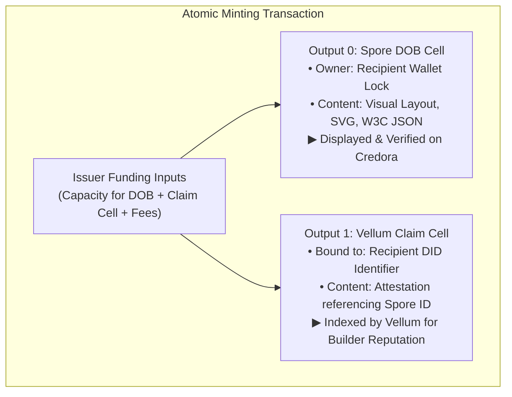

# Design Concept: Credora & Vellum Integration

> **Status:** Proposal / Conceptual Design  
> **Target:** dApp Integration between Credora & Vellum  
> **Vellum Repository:** [truthixify/vellum](https://github.com/truthixify/vellum/tree/main)  
> **Vellum Live Demo:** [https://usevellum.xyz/](https://usevellum.xyz/)  

---

## 1. Overview

Credora is an on-chain course credential dApp built on Nervos CKB that issues verifiable certificates as Spore Digital Objects (DOBs). [Vellum](https://usevellum.xyz/) is an identity and reputation platform for CKB builders providing portable `did:ckb` identifiers and verifiable attestations.

This document outlines the conceptual integration design between Credora and Vellum:
1. **Phase 1 (Live):** Recipient identity resolution via `did:ckb`.
2. **Phase 2 (Proposed / Conceptual):** Dual-output transaction flow leveraging Vellum's upcoming Claim Cell protocol to connect course achievements to builder reputation.

---

## 2. Phase 1: `did:ckb` Identity & Resolution (Live on Testnet)

In Phase 1, Credora integrates with the `@ckb-ccc/did-ckb` standard library to allow course providers to issue certificates directly to student DIDs:

* **Recipient Resolution:** When an issuer enters a `did:ckb:...` identifier in Credora (single issue or batch CSV/JSON), Credora queries the on-chain DID cell to resolve the recipient's active lock script.
* **Persistent Subject Identifier:** The issued Spore DOB records `credentialSubject.id = did:ckb:...` in accordance with W3C Verifiable Credential conventions.
* **Profile Verification:** Credora displays a verified DID badge linking directly to the recipient's identity on [Vellum](https://usevellum.xyz/).
* **Backward Compatibility:** Existing certificates issued to standard CKB addresses (`ckt1...`) remain 100% valid and supported alongside DID-issued credentials.

---

## 3. Phase 2: Dual-Output Transaction Architecture (Conceptual Proposal)

### 3.1 Background & Motivation
Vellum is currently developing a **Claim Cell protocol** (in PR review) to provide a standardized, lightweight attestation mechanism for builder reputation. 

In combining Credora with Vellum:
* **Spore DOBs** are ideal for rich, self-contained educational certificates with SVG artwork, custom layouts, and comprehensive course metadata. However, general-purpose profile dashboards cannot easily index proprietary Spore JSON schemas across different dApps.
* **Claim Cells** are minimal, uniform on-chain attestations specifically optimized for aggregators, reputation scoring, and high-throughput indexing.
* **Lock Rotation:** When a student upgrades or rotates their wallet on Vellum, their Spore DOB remains at their original lock script. A companion Claim Cell delegates verification to the user's active DID cell, allowing the student's reputation to follow their updated wallet.

### 3.2 Conceptual Architecture: Dual-Output Minting

When Vellum's Claim Cell protocol is finalized and deployed on testnet, Credora can offer an optional dual-output issuance flow within a single transaction:

### 3.3 Roles and Interaction Flow

1. **Rich Display on Credora:** The recipient and public verifiers use Credora (`/certificates` and `/verify`) to inspect the rich Spore DOB, download printable certificates, and verify course details.
2. **Reputation Aggregation on Vellum:** Vellum indexes the Claim Cell associated with the student's DID, showing a verified course badge on their [Vellum Profile](https://usevellum.xyz/) and incorporating the credential into their developer reputation score.
3. **No Cross-System Dependency:** Credora remains fully functional as an independent credential dApp. The Claim Cell integration acts as an ecosystem bridge rather than a hard operational dependency.

---

## 4. Integration Roadmap

| Phase | Milestone | Focus | Status |
|---|---|---|---|
| **Phase 1** | `did:ckb` Recipient Support | Resolve `did:ckb` via `@ckb-ccc/did-ckb`, batch CSV/JSON support, Vellum profile link | **Complete (Live on Testnet)** |
| **Phase 2A** | Protocol Tracking | Monitor Vellum Claim Cell PR review and testnet contract deployment | **In Progress** |
| **Phase 2B** | Prototype Dual-Output Tx | Compose optional Claim Cell output in Credora issuance flow once testnet scripts are deployed | **Planned** |
| **Phase 2C** | Cross-Platform Linking | Seamless bidirectional navigation between Credora certificates and Vellum builder profiles | **Planned** |

