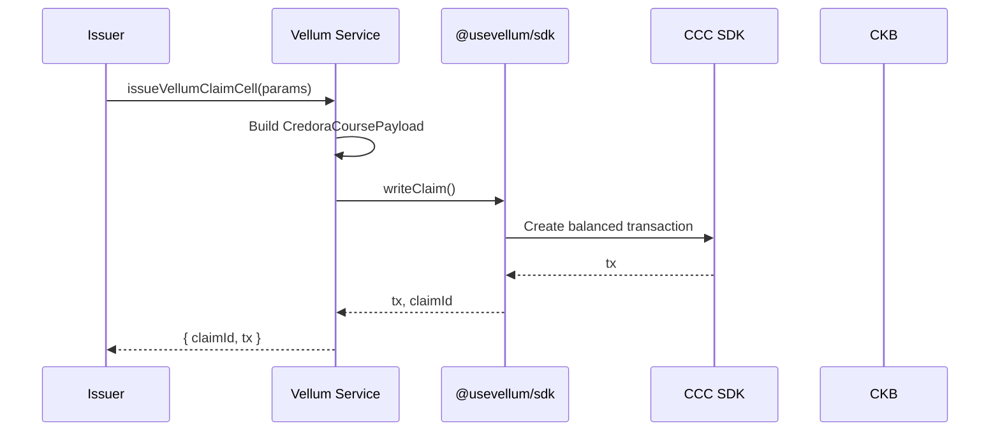
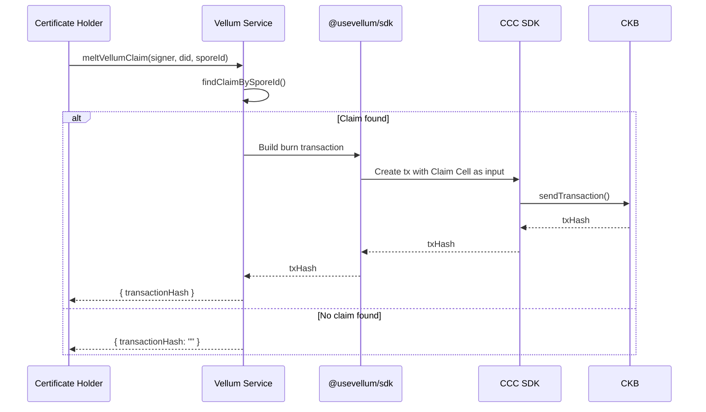
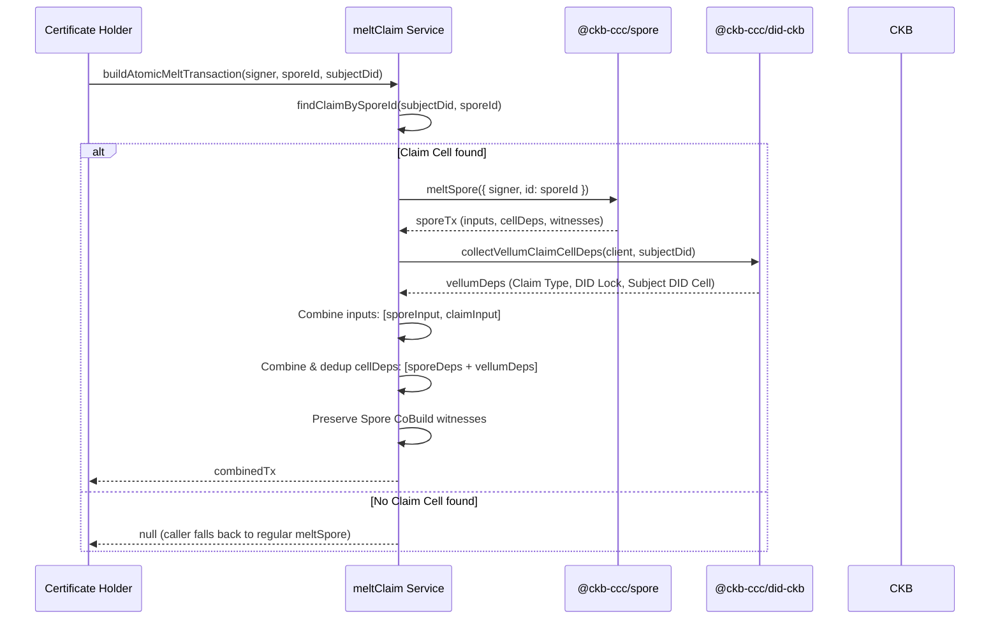
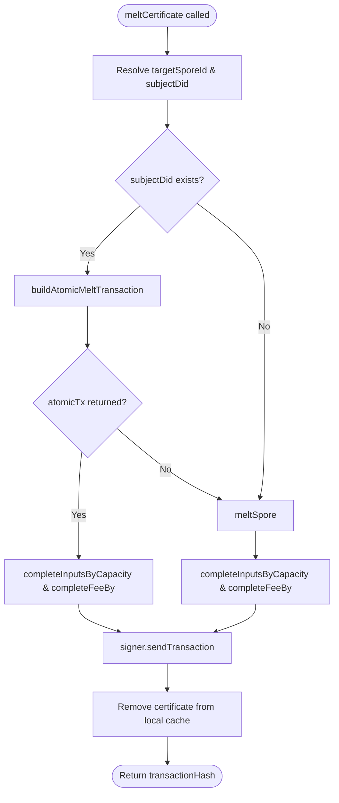

# Design Spec: Credora & Vellum Integration

> **Status:** Phase 1 Live | Phase 2 Complete ✅ | Melt Integration Complete ✅
> **Target:** dApp Integration between Credora & Vellum
> **Vellum Repository:** [truthixify/vellum](https://github.com/truthixify/vellum)
> **Vellum Dashboard:** [dashboard.usevellum.xyz](https://dashboard.usevellum.xyz)
> **Vellum M1 Report:** [talk.nervos.org](https://talk.nervos.org/t/dis-vellum-reputation-extension-on-did-ckb/10613/9)
> **SDK:** [@usevellum/sdk v0.1.0](https://www.npmjs.com/package/@usevellum/sdk)

---

## 1. Overview

Credora is a digital certificate issuance and management platform on Nervos CKB powered by the Spore Protocol. [Vellum](https://usevellum.xyz/) is an identity and reputation system for CKB builders utilizing the Claim Cell Protocol.

### 1.1 Integration Goals

| Goal | Description |
|------|-------------|
| **Portable Identity** | Certificates survive wallet rotations via DID |
| **Reputation Indexing** | Course completions indexed by Vellum |
| **Lock Rotation Resilience** | Claims follow DID, not wallet address |
| **Cross-Platform Verification** | Deep-link between Credora and Vellum profiles |

---

## 2. Phase 1: `did:ckb` Identity & Resolution (Live ✅)

### 2.1 Current Implementation

Phase 1 cho phép Credora phát hành certificate trực tiếp đến `did:ckb` identifiers:

1. **Recipient Resolution:** Khi issuer nhập `did:ckb:...`, Credora query DID cell để resolve sang active lock script
2. **W3C Compliance:** Spore DOB ghi `credentialSubject.id = did:ckb:...`
3. **Profile Link:** DID badge trên certificate link đến Vellum profile
4. **Backward Compatibility:** Certificates cũ (`ckt1...`) vẫn hoạt động 100%

### 2.2 Tech Stack

| Package | Purpose |
|---------|---------|
| `@ckb-ccc/did-ckb` | DID resolution, identity operations |
| `@ckb-ccc/core` | CKB client, codecs |

---

## 3. Phase 2: Dual-Output Transaction Architecture (Ready)

### 3.1 Background

**Vellum M1 is complete** with the Claim Cell Protocol production-ready:

| Component | Status | Details |
|-----------|--------|---------|
| Claim Type Script | ✅ Live | 47,752 bytes, ~146K cycles |
| DID Lock Script | ✅ Live | 30,336 bytes, rotation resilience |
| SDK | ✅ v0.1.0 | `@usevellum/sdk` on npm |
| Schemas | ✅ 7 schemas | Social + Community platforms |
| Reputation Scoring | ✅ v5 | Policy live on testnet |

### 3.2 Why Dual-Output?

| Problem | Solution |
|---------|----------|
| Spore DOB contains arbitrary JSON; Vellum cannot index it | Claim Cell provides a standardized signal |
| Spore is bound to a lock address | Claim Cell is bound to a DID identifier |
| Lock rotation breaks Spore ownership | DID Lock script handles rotation |

### 3.3 Architecture

```
+-------------------------------------------------------------------------------+
|                      1 Single Mint Transaction (Credora)                       |
+-------------------------------------------------------------------------------+
        |
        +---> [Output 0: Spore DOB Cell]
        |       - Lock: Recipient Wallet (secp256k1/omnilock)
        |       - Type: Spore Type (Cluster binding)
        |       - Data: W3C VC JSON + SVG layout + DNA
        |       - Purpose: Rich certificate on Credora
        |
        +---> [Output 1: Vellum Claim Cell]
                - Lock: DID Lock (subject's did:ckb)
                - Type: Claim Type (issuer DID hash + schema hash)
                - Data: ClaimDataV1 (DAG-CBOR payload)
                - Purpose: On-chain attestation for Vellum
```

### 3.4 Claim Cell Structure

**Claim Type Arguments (65 bytes):**

| Offset | Size | Value |
|--------|------|-------|
| 0 | 32 | issuer_did_code_hash |
| 32 | 1 | issuer_did_hash_type |
| 33 | 32 | schema_hash |

**ClaimData V1:**

| Field | Type | Description |
|-------|------|-------------|
| `issuer_id` | 20 bytes | Method-specific identifier |
| `nonce` | 32 bytes | Random (never reused) |
| `issued_at` | uint64 LE | Unix timestamp |
| `expires_at` | optional uint64 | Expiration |
| `payload` | bytes | DAG-CBOR (1-16,384 bytes) |

### 3.5 DID Lock Behavior

- Finds Cells matching identity Type Script hash
- Reads controller lock from identity Cell state
- Prevents self-recursion (controller ≠ current DID Lock)
- Requires controller-owned input for authorization
- **Result:** Claims survive wallet rotation automatically

---

## 4. Schema Design: `credora.course.v1`

### 4.1 Schema Definition

```typescript
// DAG-CBOR payload structure
interface CredoraCoursePayload {
  spore_id: string;           // "0x..." - Reference to Credora Spore DOB
  course_id: string;          // Course identifier
  issuer_did: string;        // "did:ckb:..." - Credora issuer DID
  issued_at: number;          // Unix timestamp
  expires_at?: number;        // Optional expiration timestamp
  metadata: {
    course_name: string;      // Display name
    completion_date: string;   // ISO date "2026-09-26"
    grade?: string;           // Optional grade
  };
}
```

### 4.2 Schema Hash

Schema hash = CKB_BLAKE2B_256(JCS(schema_manifest))

```json
{
  "name": "credora.course.v1",
  "version": "1.0.0",
  "description": "Credora course completion attestation",
  "payload": {
    "type": "object",
    "required": ["spore_id", "course_id", "issuer_did", "issued_at", "metadata"],
    "properties": {
      "spore_id": { "type": "string" },
      "course_id": { "type": "string" },
      "issuer_did": { "type": "string" },
      "issued_at": { "type": "integer" },
      "expires_at": { "type": "integer" },
      "metadata": {
        "type": "object",
        "required": ["course_name", "completion_date"],
        "properties": {
          "course_name": { "type": "string" },
          "completion_date": { "type": "string" },
          "grade": { "type": "string" }
        }
      }
    }
  }
}
```

---

## 5. SDK Integration

### 5.1 Installation

```bash
npm install @usevellum/sdk @ckb-ccc/core
```

### 5.2 Key APIs

```typescript
import { ccc } from "@ckb-ccc/core";
import { readClaims, writeClaim, writeClaims, parseClaimPayload } from "@usevellum/sdk";

// Read claims for a DID
const result = await readClaims({
  client: new ccc.ClientPublicTestnet(),
  scripts, filter: { subject: { did: subjectDid } }
});

// Write single claim
const built = await writeClaim({
  issuerSigner, scripts,
  input: { subject: { did }, issuerDid, schemaHash, payload, issuedAt }
});

// Parse claim payload
const parsed = parseClaimPayload(claim, schemaHash);
```

### 5.3 Signing Workflow

1. `writeClaim()` → returns prepared, balanced transaction
2. `signOnlyTransaction()` per signer
3. Capture tx hash before signing
4. Verify hash after each signature
5. `client.sendTransaction()` after all signatures

---

## 6. Capacity Estimation

### 6.1 Cell Sizes

| Cell Type | Base Size | Data Size | Total Estimate |
|-----------|-----------|-----------|----------------|
| **Spore DOB** | 204 bytes | ~700 bytes JSON | ~900 CKB |
| **Claim Cell** | ~150 bytes | ~200 bytes DAG-CBOR | ~350 CKB |

### 6.2 Transaction Cost

| Output | Capacity | Notes |
|--------|----------|-------|
| Spore DOB | ~900 CKB | Issuer sponsors |
| Claim Cell | ~350 CKB | Issuer sponsors |
| **Total** | **~1,250 CKB** | Dual-output mint |

---

## 7. Integration Roadmap

| Phase | Milestone | Focus | Status |
|-------|----------|-------|--------|
| **Phase 1** | `did:ckb` Recipient Support | Resolve DID, batch CSV/JSON, Vellum profile link | **Complete ✅** |
| **Phase 2A** | SDK Integration | Add `@usevellum/sdk`, design schema | **Complete ✅** |
| **Phase 2B** | Dual-Output Transaction | Compose Claim Cell output in minting flow | **Complete ✅** |
| **Phase 2C** | UI Enhancement | Toggle for Claim Cell issuance, profile link | **Complete ✅** |
| **Phase 3** | Melt Integration | Melt Claim Cell alongside Spore DOB | **Complete ✅** |
| **Phase 4** | Vellum Profile | Bidirectional navigation, course badges | **M2 pending** |

---

## 12. Testing Strategy

### 12.1 Unit Tests

| Test | Coverage | Status |
|------|----------|--------|
| Schema hash computation | Verify DAG-CBOR encoding | ✅ |
| Claim payload structure | Required fields validation | ✅ |
| Capacity calculation | Dual-output vs single output | ✅ |
| `issueVellumClaimCell` | Create Claim Cell | ✅ |
| `findClaimBySporeId` | Find Claim by Spore ID | ✅ |
| `meltVellumClaim` | Destroy Claim Cell | ✅ |

### 12.2 Integration Tests

| Test | Flow | Status |
|------|-------|--------|
| Mint with Claim Cell | Single transaction, two outputs | ✅ |
| DID resolution | Resolve DID, verify Claim Cell | ✅ |
| Melt Certificate + Claim | Both cells destroyed | ✅ |
| Melt old certificate | DID resolved from lock script | ✅ |

---

## 13. Files to Modify

### 13.1 New Files

| File | Purpose |
|------|---------|
| `src/lib/credentials/vellumClaim.ts` | Vellum Claim Cell integration |
| `src/lib/credentials/meltClaim.ts` | Claim Cell melt logic |
| `src/lib/credentials/schemas/credoraCourse.ts` | Schema definition + hash |
| `tests/unit/credentials/vellumClaim.test.ts` | Unit tests |
| `tests/unit/credentials/meltClaim.test.ts` | Melt tests |
| `tests/integration/vellumClaim.test.ts` | Integration tests |

### 13.2 Modified Files

| File | Changes |
|------|---------|
| `src/lib/credentials/issuer.ts` | Add meltVellumClaim integration |
| `src/lib/credentials/index.ts` | Export new functions |
| `src/lib/storage/cache.ts` | Add subjectDid field |
| `src/app/certificates/page.tsx` | Handle claimTxHash result |
| `package.json` | Add `@usevellum/sdk` dependency |

---

## 14. Bug Fixes: Melt Claim Cell Issue

### 14.1 The Problem

When melting a certificate, only the Spore DOB Cell was destroyed. The Claim Cell remained on-chain because:

1. **Claim Cell is created with subject's DID**
2. **credentialSubject.id contains wallet address** (not DID)
3. **readClaims() failed to find the Claim** because it searched with wallet address

### 14.2 Root Cause

```
Issue Certificate:
  credentialSubject.id = "ckt1qzda0cr08m85hc8j9np..." (wallet address)
                  ↓
  resolveRecipientInput() → DID = "did:ckb:qqtest..."
                  ↓
  Claim Cell created with subject: { did: "did:ckb:qqtest..." }

Melt Certificate (BUG):
  credentialSubject.id = "ckt1qzda0cr08m85hc8j9np..." (wallet address)
                  ↓
  readClaims({ subject: { did: "ckt1qzda..." } }) ← WRONG!
                  ↓
  Claim not found → Not melted!
```

### 14.3 Three Commits Fix

| Commit | Fix |
|--------|-----|
| `cdb09c8` | Add `subjectDid` field to `CertificateStorageItem` |
| `3e8f619` | Store `subjectDid` in cache when issuing certificate |
| `d87e5cb` | Resolve DID from lock script when `subjectDid` not in cache |

### 14.4 DID Resolution Flow

```typescript
async function resolveSubjectDid(signer, cert) {
  // Priority 1: subjectDid from cache (new certificates)
  if (cert.subjectDid) return cert.subjectDid;

  // Priority 2: credentialSubject.id is already a DID
  if (cert.certificate.credentialSubject.id?.startsWith('did:ckb:')) {
    return cert.certificate.credentialSubject.id;
  }

  // Priority 3: Resolve DID from holder's lock script (old certificates)
  const holderLock = await signer.getRecommendedAddressObj();
  return await findDidByLock(signer.client, holderLock.script);
}
```

### 14.5 After Fix

```
meltCertificate()
        ↓
  Resolve DID (3 methods above)
        ↓
  meltVellumClaim(signer, DID, sporeId)
        ↓
  Claim Cell destroyed ✅
```

---

## 15. Open Questions

1. **Schema Registration:** Should Credora publish schema to Vellum registry?
2. **Issuer DID:** Create dedicated Credora issuer DID or use existing?
3. **Optional vs Default:** Should Claim Cell issuance be opt-in or default?
4. **Mainnet Timing:** Wait for Vellum mainnet deployment?

---

## 10. Unit Design: Vellum Claim Cell Integration

### 10.1 Overview

| Item | Details |
|------|---------|
| **Module** | Vellum Claim Cell Service |
| **Files** | `src/lib/credentials/vellumClaim.ts`, `src/lib/credentials/meltClaim.ts` |
| **Purpose** | Create and destroy Vellum Claim Cells alongside Spore DOBs |
| **Dependencies** | `@usevellum/sdk`, `@ckb-ccc/core`, `@ckb-ccc/did-ckb` |

---

### 10.2 Public API

#### 10.2.1 Functions

```typescript
// Create a Vellum Claim Cell (called during certificate issuance)
async function issueVellumClaimCell(params: {
  signer: ccc.Signer;
  sporeId: string;
  issuerDid: string;
  recipientDid: string;
  issuerDidCodeHash: string;
}): Promise<{ claimId: string; tx: ccc.TransactionLike }>

// Find Claim Cell by its referenced Spore ID
async function findClaimBySporeId(params: {
  client: ccc.Client;
  subjectDid: string;
  sporeId: string;
  scripts?: ReturnType<typeof getVellumScriptConfig>;
}): Promise<{ claim: Claim; outPoint: ccc.OutPoint } | null>

// Melt (destroy) a Vellum Claim Cell individually
async function meltVellumClaim(
  signer: ccc.Signer,
  subjectDid: string,
  sporeId: string,
  options?: MeltVellumClaimOptions,
): Promise<{ transactionHash: string }>

// Melt a Vellum Claim Cell with all necessary cellDeps (Claim Type, DID Lock, DID Identity)
async function meltVellumClaimWithCellDeps(
  signer: ccc.Signer,
  subjectDid: string,
  sporeId: string,
): Promise<{ transactionHash: string }>

// Build a single atomic transaction destroying both Spore DOB and Claim Cell
async function buildAtomicMeltTransaction(
  signer: ccc.Signer,
  sporeId: \`0x${string}\`,
  subjectDid: string,
): Promise<ccc.Transaction | null>

// Collect required cellDeps for Claim Cell destruction (Claim Type + DID Lock + Subject DID Cell)
async function collectVellumClaimCellDeps(
  client: ccc.Client,
  subjectDid: string,
): Promise<ccc.CellDep[]>

// Deduplicate cellDeps by txHash, index, and depType
function dedupCellDeps(cellDeps: ccc.CellDep[]): ccc.CellDep[]
```

#### 10.2.2 Types

```typescript
interface VellumClaimResult {
  claimId: string;
  transactionHash?: string;
  sporeId: string;
  certificateId: string;
}

interface FindClaimResult {
  claim: Claim;
  outPoint: ccc.OutPoint;
}

interface MeltVellumClaimOptions {
  /** Include Claim Type and DID Lock cellDeps for proper script execution */
  includeCellDeps?: boolean;
}
```

---

### 10.3 Function Specifications

#### 10.3.1 issueVellumClaimCell

**Purpose**: Create a Vellum Claim Cell alongside a Spore DOB during certificate issuance.

**Parameters**:
| Param | Type | Required | Description |
|-------|------|----------|-------------|
| `signer` | `ccc.Signer` | Yes | Issuer's wallet signer |
| `sporeId` | `string` | Yes | Spore ID of the certificate DOB |
| `issuerDid` | `string` | Yes | Issuer's DID (did:ckb:...) |
| `recipientDid` | `string` | Yes | Recipient's DID (did:ckb:...) |
| `issuerDidCodeHash` | `string` | Yes | Code hash of issuer's DID |

**Process**:

```mermaid
sequenceDiagram
    participant ISSUER as Issuer
    participant SVC as Vellum Service
    participant SDK as @usevellum/sdk
    participant CCC as CCC SDK
    participant CKB

    ISSUER->>SVC: issueVellumClaimCell(params)
    SVC->>SVC: Build CredoraCoursePayload
    SVC->>SDK: writeClaim()
    SDK->>CCC: Create balanced transaction
    CCC-->>SDK: tx
    SDK-->>SVC: tx, claimId
    SVC-->>ISSUER: { claimId, tx }
```

**Claim Payload**:
```typescript
interface CredoraCoursePayload {
  spore_id: string;      // Reference to Spore DOB
  course_id: string;    // From certificate
  issuer_did: string;   // Issuer DID
  issued_at: number;    // Unix timestamp
  metadata: {
    course_name: string;
    completion_date: string;
    grade?: string;
  };
}
```

**Transaction Details**:
```
Input:  Issuer's CKB cells (for capacity + fee)
Output: Vellum Claim Cell
        - Lock: DID Lock (recipient's did:ckb)
        - Type: Claim Type (issuer hash + schema hash)
        - Data: DAG-CBOR encoded payload
Fee:    ~0.001 CKB
```

---

#### 10.3.2 findClaimBySporeId

**Purpose**: Find an existing Claim Cell by searching for its referenced Spore ID.

**Parameters**:
| Param | Type | Required | Description |
|-------|------|----------|-------------|
| `client` | `ccc.Client` | Yes | CKB client |
| `subjectDid` | `string` | Yes | Subject's DID to search claims |
| `sporeId` | `string` | Yes | Spore ID to match |
| `scripts` | `object` | No | Vellum script config |

**Returns**: `{ claim: Claim; outPoint: ccc.OutPoint } | null`

**Process**:
1. Query Vellum SDK `readClaims()` for all claims of the subject DID
2. Filter claims matching the Credora course schema
3. Match claim where `payload.spore_id === sporeId`
4. Return matched claim and its outPoint

---

#### 10.3.3 meltVellumClaim

**Purpose**: Destroy a Vellum Claim Cell to reclaim CKB capacity.

**Parameters**:
| Param | Type | Required | Description |
|-------|------|----------|-------------|
| `signer` | `ccc.Signer` | Yes | Holder's wallet signer |
| `subjectDid` | `string` | Yes | Subject's DID used for the Claim |
| `sporeId` | `string` | Yes | Spore ID referenced by the Claim |

**Returns**: `{ transactionHash: string }`

**Process**:

```mermaid
sequenceDiagram
    participant HOLDER as Certificate Holder
    participant SVC as Vellum Service
    participant SDK as @usevellum/sdk
    participant CCC as CCC SDK
    participant CKB

    HOLDER->>SVC: meltVellumClaim(signer, did, sporeId)
    SVC->>SVC: findClaimBySporeId()
    alt Claim found
        SVC->>SDK: Build burn transaction
        SDK->>CCC: Create tx with Claim Cell as input
        CCC->>CKB: sendTransaction()
        CKB-->>CCC: txHash
        CCC-->>SDK: txHash
        SDK-->>SVC: txHash
        SVC-->>HOLDER: { transactionHash }
    else No claim found
        SVC-->>HOLDER: { transactionHash: "" }
    end
```

**Transaction Details**:
```
Input:  Vellum Claim Cell (destroyed)
Output: None (cell consumed)
Fee:    ~0.001 CKB
Capacity: Reclaimed to holder's wallet
```

---

#### 10.3.4 buildAtomicMeltTransaction

**Purpose**: Construct a single atomic CKB transaction that simultaneously destroys both the Spore DOB Cell and its associated Vellum Claim Cell.

**Parameters**:
| Param | Type | Required | Description |
|-------|------|----------|-------------|
| `signer` | `ccc.Signer` | Yes | Holder's wallet signer |
| `sporeId` | `0x${string}` | Yes | Spore ID of the certificate to melt |
| `subjectDid` | `string` | Yes | Subject's DID (used to locate Claim Cell) |

**Returns**: `Promise<ccc.Transaction | null>` (returns `null` if no Claim Cell exists or lookup fails)

**Process**:

```mermaid
sequenceDiagram
    participant HOLDER as Certificate Holder
    participant SVC as meltClaim Service
    participant SPORE as @ckb-ccc/spore
    participant DID as @ckb-ccc/did-ckb
    participant CKB

    HOLDER->>SVC: buildAtomicMeltTransaction(signer, sporeId, subjectDid)
    SVC->>SVC: findClaimBySporeId(subjectDid, sporeId)
    alt Claim Cell found
        SVC->>SPORE: meltSpore({ signer, id: sporeId })
        SPORE-->>SVC: sporeTx (inputs, cellDeps, witnesses)
        SVC->>DID: collectVellumClaimCellDeps(client, subjectDid)
        DID-->>SVC: vellumDeps (Claim Type, DID Lock, Subject DID Cell)
        SVC->>SVC: Combine inputs: [sporeInput, claimInput]
        SVC->>SVC: Combine & dedup cellDeps: [sporeDeps + vellumDeps]
        SVC->>SVC: Preserve Spore CoBuild witnesses
        SVC-->>HOLDER: combinedTx
    else No Claim Cell found
        SVC-->>HOLDER: null (caller falls back to regular meltSpore)
    end
```

**Transaction Anatomy**:
```
Inputs:
  [0]: Spore DOB Cell (from meltSpore)
  [1]: Vellum Claim Cell (new ccc.CellInput(claimOutPoint, 0n))

CellDeps:
  - Spore contract cellDeps (cluster, spore type script)
  - Spore CoBuild contract cellDep
  - Vellum Claim Type script cellDep (0xaf693346...:0)
  - Vellum DID Lock script cellDep (0xaf693346...:1)
  - Subject DID Identity Cell (didRecord.cell.outPoint, code dep)

Witnesses:
  - Preserves Spore CoBuild witness from sporeTx.witnesses
  - Placeholder for holder lock signature

Outputs:
  - Consumed cells have no corresponding outputs (burn)
  - Balanced by completeInputsByCapacity / completeFeeBy:
    -> 1 output returning combined capacity (Spore DOB + Claim Cell) to holder
```

---

#### 10.3.5 collectVellumClaimCellDeps & dedupCellDeps

**Purpose**: Assemble and deduplicate all script and data dependencies required to validate Claim Cell destruction under CKB's DID Lock.

1. **Claim Type script cellDep**: Deployment tx `0xaf693346...`, output index `0`.
2. **DID Lock script cellDep**: Deployment tx `0xaf693346...`, output index `1` (`code_hash: 0xe1562cc5...`).
3. **Subject DID Identity Cell**: Dynamically resolved via `resolveDidCkb({ client, did: subjectDid })`. Required by DID Lock to inspect the authorized controller lock.
4. **`dedupCellDeps`**: Filters out duplicates by `${txHash}:${index}:${depType}` ensuring no redundant cell deps when combining with Spore transaction cell deps.

---

### 10.4 DID Resolution: subjectDid vs credentialSubject.id

#### The Problem

When issuing a certificate with a Vellum Claim:
- `credentialSubject.id` = wallet address entered by user
- Claim Cell is created with subject's DID (resolved from wallet)

When melting:
- Need DID to find Claim Cell (not wallet address)
- `credentialSubject.id` may be a wallet address, not a DID

#### The Solution

```typescript
async function meltCertificate(signer, certificateId) {
  const cert = await getCertificate(certificateId);

  // Step 1: Try to get DID from cache (for new certificates)
  let subjectDid = cert.subjectDid;

  // Step 2: Fallback - check if credentialSubject.id is a DID
  if (!subjectDid && cert.certificate.credentialSubject.id?.startsWith('did:ckb:')) {
    subjectDid = cert.certificate.credentialSubject.id;
  }

  // Step 3: Fallback - resolve DID from holder's lock script
  if (!subjectDid) {
    const holderLock = await signer.getRecommendedAddressObj();
    subjectDid = await findDidByLock(signer.client, holderLock.script);
  }

  // Step 4: Melt Claim Cell with resolved DID
  if (subjectDid) {
    await meltVellumClaim(signer, subjectDid, cert.sporeId);
  }
}
```

---

### 10.5 Integration with meltCertificate

When `meltCertificate()` is called, it prioritizes **Atomic Melt** (Spore DOB + Vellum Claim Cell in a single transaction):


```mermaid
flowchart TD
    Start([meltCertificate called]) --> Resolve[Resolve targetSporeId & subjectDid]
    Resolve --> CheckDID{subjectDid exists?}
    CheckDID -- Yes --> BuildAtomic[buildAtomicMeltTransaction]
    CheckDID -- No --> RegularMelt[meltSpore]
    BuildAtomic --> AtomicSuccess{atomicTx returned?}
    AtomicSuccess -- Yes --> CompleteTx[completeInputsByCapacity & completeFeeBy]
    AtomicSuccess -- No --> RegularMelt
    RegularMelt --> CompleteSpore[completeInputsByCapacity & completeFeeBy]
    CompleteTx --> SendTx[signer.sendTransaction]
    CompleteSpore --> SendTx
    SendTx --> ClearCache[Remove certificate from local cache]
    ClearCache --> Done([Return transactionHash])
```

```typescript
async function meltCertificate(
  signer: unknown,
  certificateId: string,
): Promise<{ transactionHash: string; claimTxHash?: string }> {
  const liveSigner = signer as ccc.Signer;
  // 1. Resolve on-chain targetSporeId and subjectDid (cache -> credentialSubject.id -> holderLock)
  ...
  let meltTx: ccc.Transaction | null = null;

  // 2. Atomic Melt: Spore DOB + Claim Cell in ONE transaction
  if (subjectDid && finalSporeId) {
    try {
      const atomicTx = await buildAtomicMeltTransaction(
        liveSigner,
        finalSporeId,
        subjectDid,
      );

      if (atomicTx) {
        await atomicTx.completeInputsByCapacity(liveSigner);
        await atomicTx.completeFeeBy(liveSigner, 1000);
        meltTx = atomicTx;
      }
    } catch {
      // Fallback to regular melt if atomic fails (e.g. claim already destroyed)
    }
  }

  // 3. Fallback to regular meltSpore if no Claim Cell exists
  if (!meltTx) {
    const { tx } = await meltSpore({ signer: liveSigner, id: finalSporeId });
    await tx.completeInputsByCapacity(liveSigner);
    await tx.completeFeeBy(liveSigner, 1000);
    meltTx = tx;
  }

  // 4. Send single transaction reclaiming all capacities
  const meltTxHash = await liveSigner.sendTransaction(meltTx);

  // 5. Cleanup local cache
  ...
  return { transactionHash: meltTxHash };
}
```

---

## 16. Atomic Melt & Script Verification Troubleshooting

### 16.1 Issue: ScriptNotFound for DID Lock (October 2026)

**Symptom**: When executing atomic melt on CKB Testnet, the node rejected the transaction with:
```
TransactionScriptError {
  source: Inputs[1].Lock,
  cause: ScriptNotFound: code_hash: Byte32(0xe1562cc57b4bd91619ada2f7e74d63805ea7038a7b6de0b18a529d51aa883d2d)
}
```

**Root Cause**:
- `Inputs[1]` is the Vellum Claim Cell whose lock script is DID Lock (`code_hash: 0xe1562cc5...`).
- The initial transaction composition only added `scripts.claimType.cellDeps` (index 0), omitting `scripts.didLock.cellDeps` (index 1).
- In addition, the DID Lock script requires the subject's live `did:ckb` Identity Cell in `cellDeps` to verify the controller lock.
- `sporeTx.cellDeps` and `sporeTx.witnesses` (Spore CoBuild) were previously omitted, which would cause Spore verification to fail.

**Fix Applied**:
1. Implemented `collectVellumClaimCellDeps`:
   - Adds Claim Type cellDep (`txHash: 0xaf693346...`, `index: 0`).
   - Adds DID Lock cellDep (`txHash: 0xaf693346...`, `index: 1`).
   - Dynamically resolves subject DID via `resolveDidCkb({ client, did: subjectDid })` and appends `didRecord.cell.outPoint` (`depType: 'code'`).
2. Implemented `dedupCellDeps` to merge `sporeTx.cellDeps` with Vellum cellDeps without duplicate outpoints.
3. Updated `buildAtomicMeltTransaction` to preserve `sporeTx.witnesses` (Spore CoBuild) and wrap outpoints with `ccc.OutPoint.from` to ensure methods like `.clone()` exist.

**On-Chain Verification**:
- Certificate Issuance Tx: [`0x10857c22771683f90681ce6d110b842678d3fcc76e1920faf4b0f525eb9cde68`](https://testnet.explorer.nervos.org/transaction/0x10857c22771683f90681ce6d110b842678d3fcc76e1920faf4b0f525eb9cde68)
- Atomic Melt Tx: [`0x077f511750392a2544d5ee383f7ed3630320d87408c462cb5566c0f42602eb35`](https://testnet.explorer.nervos.org/transaction/0x077f511750392a2544d5ee383f7ed3630320d87408c462cb5566c0f42602eb35)
- Status: **Committed** at block `0x15922a7` (`22,618,791`), consuming `1,591,292` cycles and reclaiming `143.19944208 CKB` capacity in a single output.

---

## 11. References

- [Vellum Repository](https://github.com/truthixify/vellum)
- [@usevellum/sdk npm](https://www.npmjs.com/package/@usevellum/sdk)
- [M1 Delivery Report](https://talk.nervos.org/t/dis-vellum-reputation-extension-on-did-ckb/10613/9)
- [Claim Cell Protocol](https://github.com/truthixify/vellum/blob/main/docs/claim-cell.md)
- [Claim SDK Docs](https://github.com/truthixify/vellum/blob/main/docs/claim-sdk.md)

---

*Last Updated: October 2026*
