# CKB Credential Registry — Implementation Architecture

> **Updated Scope**: Course completion certificate registry focusing on course providers, students, and verifiers.

---

## Table of Contents

1. [Overview](#1-overview)
2. [Feature Specification](#2-feature-specification)
3. [System Architecture](#3-system-architecture)
4. [Project Structure](#4-project-structure)
5. [Data Structures](#5-data-structures)
6. [Module Design](#6-module-design)
7. [User Flows](#7-user-flows)
8. [Custom On-Chain Scripts (Future)](#8-custom-on-chain-scripts-future)
9. [Testing Strategy](#9-testing-strategy)
10. [Deployment Configuration](#10-deployment-configuration)
11. [Milestones](#11-milestones)

---

## 1. Overview

### 1.1 Design Principles

- **Self-Sovereign**: Users own their certificates as on-chain assets
- **Composable**: Built on existing standards (W3C VC, Spore, CCC SDK)
- **Course-Centric**: Focused on course completion certificates
- **CKB-Native**: Leverage CKB's unique advantages (zero fees, on-chain storage)

### 1.2 Core Value Propositions

| Feature | Status | Implementation |
|---------|--------|----------------|
| **Fully on-chain** | ✅ | Spore DOB DNA (certificate JSON) |
| **Holder-owned** | ✅ | Spore DOB lock = recipient wallet |
| **CKB-backed** | ✅ | Spore capacity + melt-to-reclaim |
| **Zero transfer fees** | ✅ | CKB UTXO model |
| **Cluster organization** | ✅ | Spore Cluster = Course Provider |

---

## 2. Feature Specification

### 2.1 Core Features (MVP)

| Feature | Priority | Description |
|---------|----------|-------------|
| **F1: Wallet Connection** | P0 | Connect via JoyID, MetaMask, Neuron, Portal |
| **F2: Provider Registration** | P0 | Course provider creates Cluster |
| **F3: Certificate Issuance** | P0 | Issue course completion certificate |
| **F4: Certificate Display** | P0 | Student views certificates in dashboard |
| **F5: Certificate Sharing** | P0 | Copy ID, open in Explorer |
| **F6: Certificate Verification** | P0 | Verify certificate by ID |

### 2.2 Extended Features

| Feature | Priority | Description |
|---------|----------|-------------|
| **F7: Certificate Templates** | P1 | Pre-defined certificate formats |
| **F8: Batch Issuance** | P1 | Issue multiple certificates at once |
| **F9: Expiration** | P1 | Time-based certificate validity |
| **F10: Melt Certificate** | P1 | Permanently destroy certificate and reclaim CKB |

### 2.3 Future Features

| Feature | Priority | Description |
|---------|----------|-------------|
| **F11: Renewal** | P2 | Update expiration date |
| **F12: Embedding** | P2 | Embed on external platforms |
| **F13: Trust Layer** | P2 | Verified issuers registry |
| **F14: Analytics** | P2 | Provider issuance statistics |
| **F15: Comments** | P3 | Student comments/reviews |

### 2.4 User Roles

| Role | Capabilities |
|------|-------------|
| **Course Provider** | Register, Issue Certificates |
| **Student** | View Own Certificates, Share, Transfer (if allowed) |
| **Verifier** | Verify Certificate Validity |

---

## 3. System Architecture

### 3.1 Architecture Overview

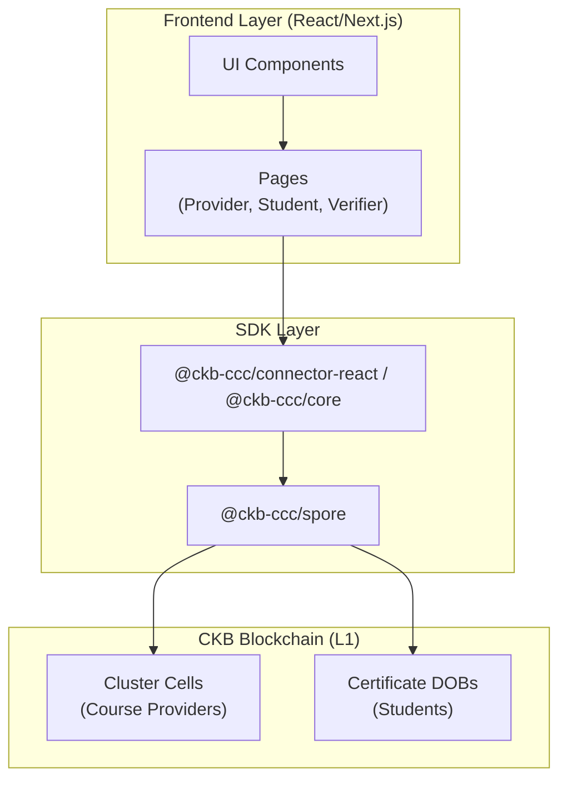

### 3.2 Component Interaction

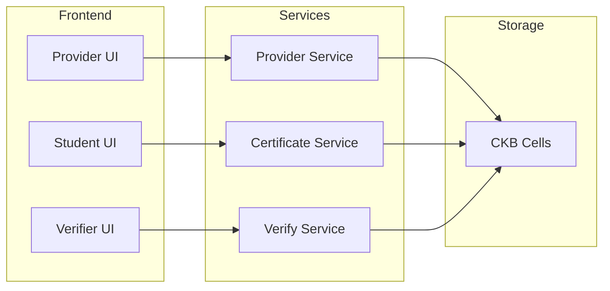

---

## 4. Project Structure

### 4.1 Directory Layout

```
dob-credential-protocol/
├── src/
│   ├── app/
│   │   ├── layout.tsx               # Root layout with CCC Provider
│   │   ├── page.tsx                 # Landing page
│   │   ├── provider/
│   │   │   └── page.tsx             # Provider dashboard
│   │   ├── student/
│   │   │   └── page.tsx             # Student dashboard
│   │   └── verifier/
│   │       └── page.tsx             # Verification page
│   │
│   ├── components/
│   │   ├── ui/                      # Generic UI components
│   │   ├── wallet/
│   │   │   └── WalletConnect.tsx
│   │   ├── certificate/
│   │   │   ├── CertificateCard.tsx
│   │   │   ├── CertificateDetail.tsx
│   │   │   ├── CertificateForm.tsx
│   │   │   └── BatchIssuance.tsx
│   │   ├── cluster/
│   │   │   ├── ClusterCard.tsx
│   │   │   └── ClusterForm.tsx
│   │   ├── template/
│   │   │   ├── TemplateCard.tsx
│   │   │   └── TemplateForm.tsx
│   │   └── verification/
│   │       └── VerifyResult.tsx
│   │
│   ├── lib/
│   │   ├── ckb/
│   │   │   ├── config.ts            # Network & script configs
│   │   │   └── client.ts            # Client setup
│   │   ├── certificates/
│   │   │   ├── types.ts             # TypeScript interfaces
│   │   │   ├── encoder.ts            # W3C VC JSON encoding
│   │   │   ├── decoder.ts            # W3C VC JSON decoding
│   │   │   ├── issuer.ts             # Certificate issuance logic
│   │   │   ├── verifier.ts           # Certificate verification logic
│   │   │   └── templates.ts          # Template management
│   │   └── utils/
│   │       └── formatters.ts
│   │
│   └── styles/
│       └── globals.css
│
├── contracts/                        # Rust on-chain scripts (future)
│   ├── Cargo.toml
│   └── src/
│       ├── main.rs
│       └── credential.rs
│
├── package.json
├── tsconfig.json
├── next.config.js
├── tailwind.config.js
└── README.md
```

---

## 5. Data Structures

### 5.1 Certificate DNA (W3C VC)

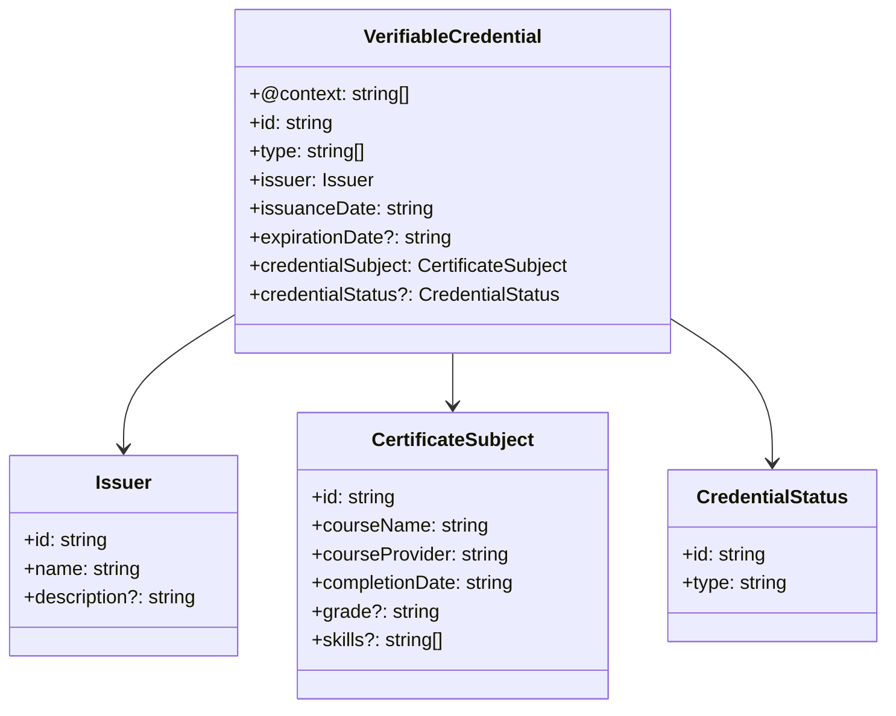

### 5.2 TypeScript Interfaces

```typescript
// Certificate DNA (W3C VC Compatible)
interface VerifiableCredential {
  "@context": string[];
  id: string;
  type: string[];
  issuer: Issuer;
  issuanceDate: string;
  expirationDate?: string;
  credentialSubject: CertificateSubject;
  credentialStatus?: CredentialStatus;
  metadata?: CertificateMetadata;
}

interface Issuer {
  id: string;
  name: string;
  description?: string;
}

interface CertificateSubject {
  id: string;
  courseName: string;
  courseProvider: string;
  completionDate: string;
  grade?: string;
  skills?: string[];
}

interface CredentialStatus {
  id: string;
  type: string;
}

interface CertificateMetadata {
  clusterId: string;
  templateId?: string;
  version: string;
}

// Cluster Configuration
interface ClusterConfig {
  name: string;
  description: string;
  providerInfo: ProviderInfo;
  certificatePolicy: CertificatePolicy;
  metadata?: Record<string, any>;
}

interface ProviderInfo {
  url?: string;
  logo?: string;
  contact?: string;
}

interface CertificatePolicy {
  transferable: boolean;
  expirationDefault?: string;
  allowRenewal: boolean;
}

// Certificate Template
interface CertificateTemplate {
  id: string;
  name: string;
  description: string;
  clusterId: string;
  fields: TemplateField[];
  requiredFields: string[];
  defaultValues?: Record<string, any>;
}

interface TemplateField {
  name: string;
  type: 'text' | 'date' | 'select' | 'number';
  label: string;
  required: boolean;
  options?: string[];
}

// Verification
interface VerificationResult {
  valid: boolean;
  certificateId: string;
  issuer: {
    id: string;
    name: string;
    clusterVerified: boolean;
  };
  holder: {
    address: string;
    ownershipVerified: boolean;
  };
  certificate: {
    type: string[];
    issuanceDate: string;
    expirationDate?: string;
    isExpired: boolean;
  };
  timestamp: string;
}
```

---

## 6. Module Design

### 6.1 Module Overview

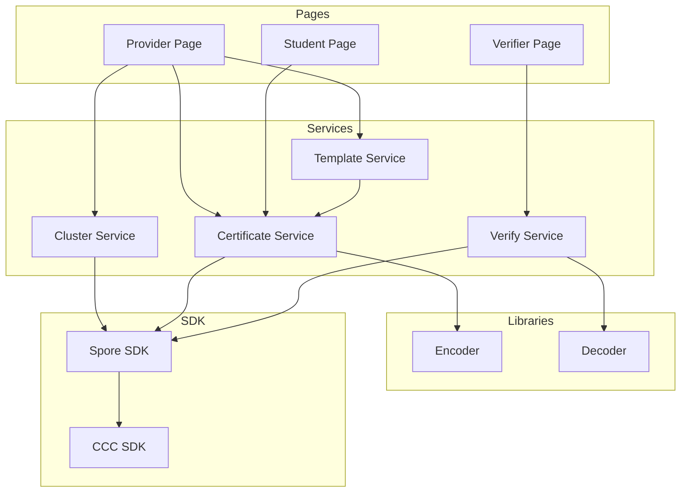

### 6.2 Service Responsibilities

| Module | Operations |
|--------|-----------|
| **Cluster Service** | `createCluster`, `getClusters` |
| **Certificate Service** | `issueCertificate`, `getHolderCertificates`, `meltCertificate` |
| **Verify Service** | `verifyCertificate`, `isExpired` |
| **Template Service** | `createTemplate`, `getTemplates`, `applyTemplate` |

### 6.3 SDK Usage

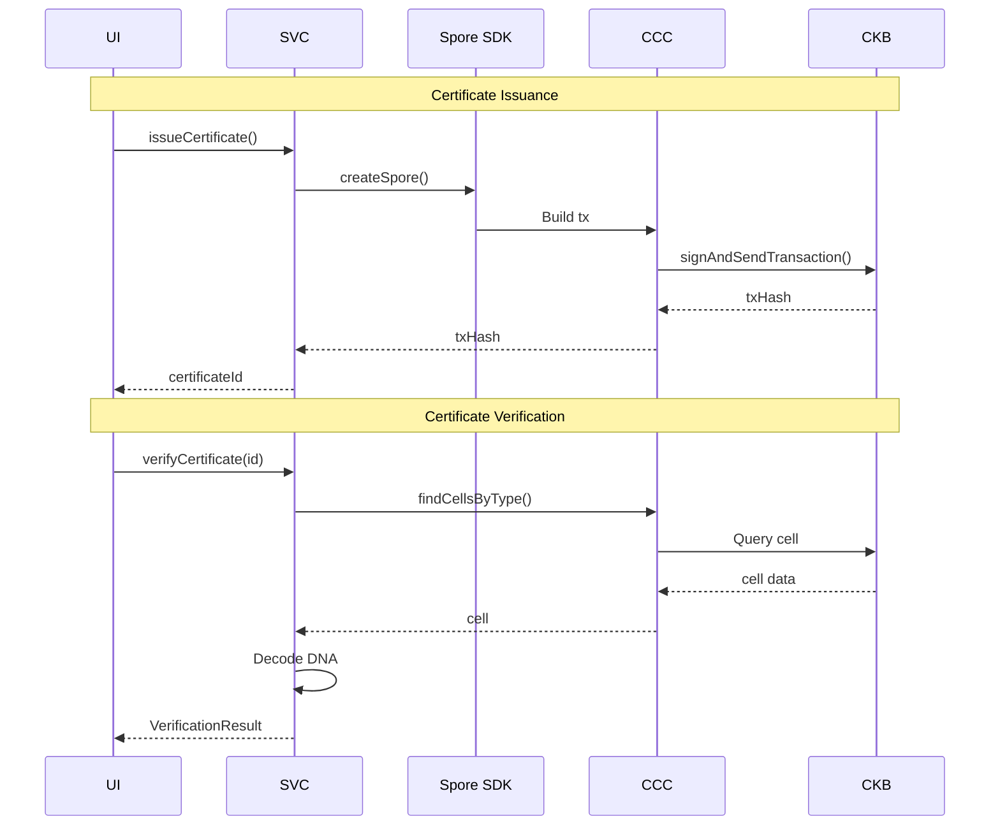

---

## 7. User Flows

### 7.1 Provider Registration Flow

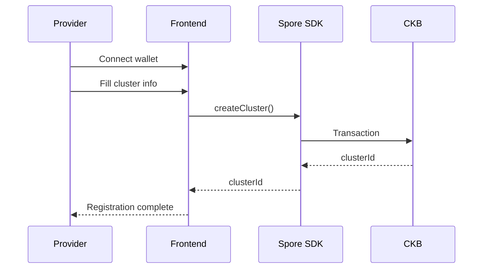

### 7.2 Certificate Issuance Flow

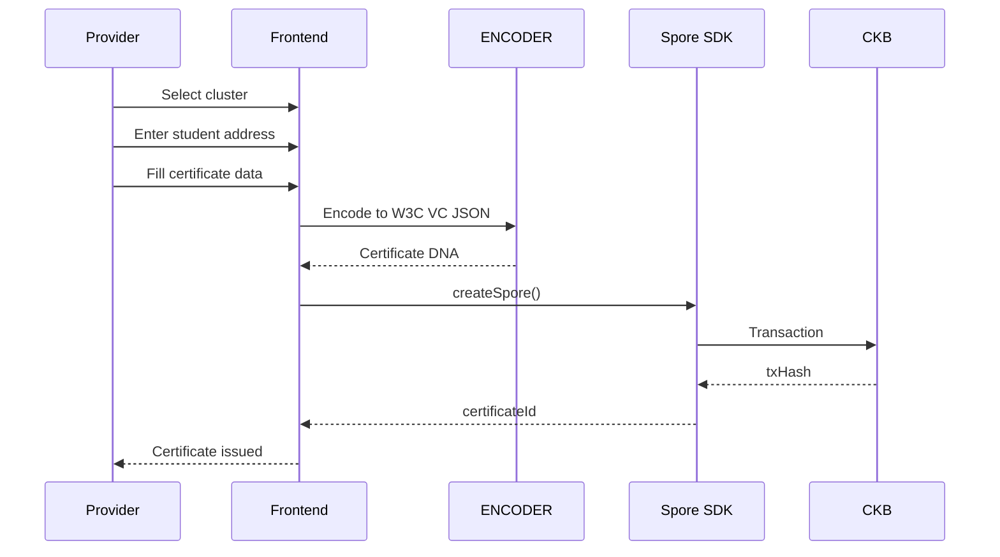

### 7.3 Verification Flow

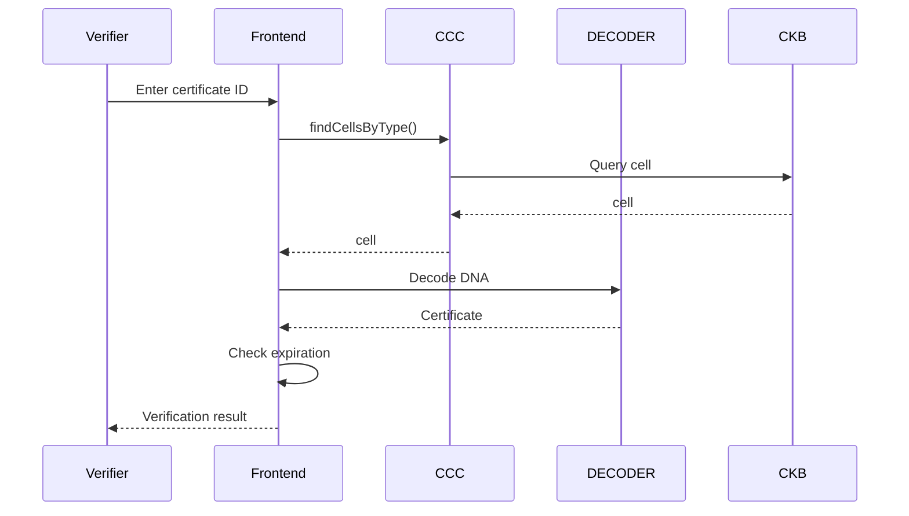

### 7.4 Batch Issuance Flow

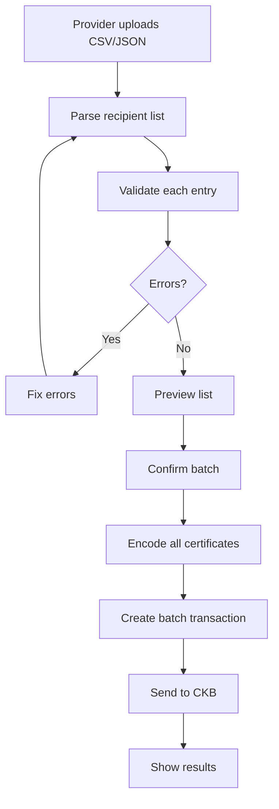

---

## 8. Custom On-Chain Scripts (Future)

### 8.1 Soulbound Certificate Script

For non-transferable certificates, a custom Type Script may be needed.

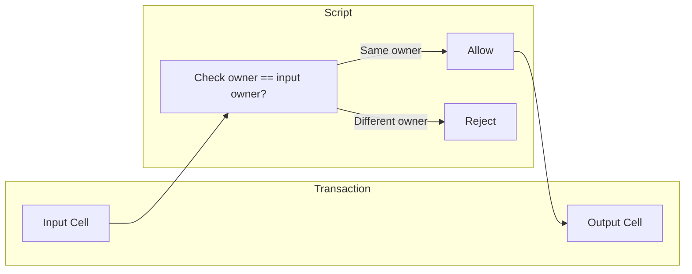

---

## 9. Testing Strategy

### 9.1 Test Layers

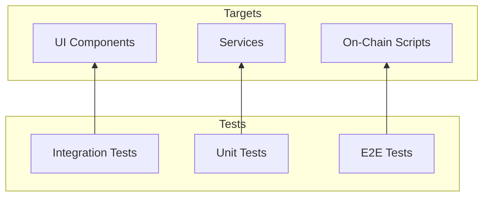

### 9.2 Test Matrix

| Test | Target | Tools |
|------|--------|-------|
| Unit Tests | Encoder/Decoder | Vitest |
| Unit Tests | Service functions | Vitest |
| Integration | Transaction building | CCC + Mock |
| E2E | Full flows | Playwright |

---

## 10. Deployment Configuration

### 10.1 Network Configuration

| Environment | Network | CKB Node | Indexer |
|-------------|---------|----------|---------|
| Development | OffCKB Devnet | localhost:28114 | localhost:28114 |
| Testnet | CKB Testnet | testnet.ckb.dev | testnet.ckb.dev |
| Mainnet | CKB Mainnet | mainnet.ckb.com | mainnet.ckb.com |

---

## 11. Milestones

### 11.1 Timeline

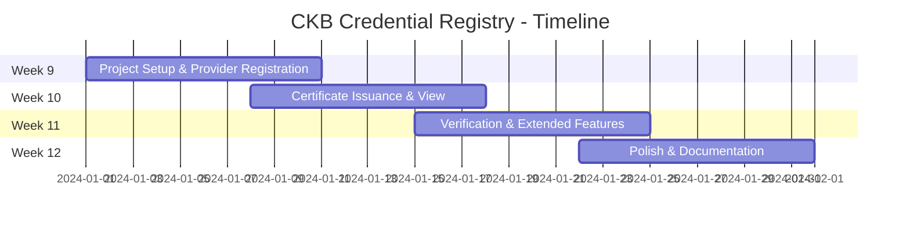

### 11.2 Week-by-Week Milestones

| Week | Milestone | Deliverables |
|------|-----------|--------------|
| **Week 9** | Project Setup & Provider Registration | Scaffold, wallet connection, Cluster creation |
| **Week 10** | Certificate Issuance & View | Issuance, W3C VC encoding, holder dashboard |
| **Week 11** | Verification & Extended Features | Verify, templates, batch, melt certificate |
| **Week 12** | Polish & Documentation | Error handling, testing, README, demo |

---

## Appendix: Feature Coverage

### Original Core Value Propositions

| Feature | Status | Implementation |
|---------|--------|----------------|
| Fully on-chain | ✅ | Spore DOB DNA |
| Holder-owned | ✅ | Spore lock script |
| CKB-backed | ✅ | Spore capacity + melt |
| Zero transfer fees | ✅ | CKB UTXO model |
| Cluster organization | ✅ | Spore Cluster |

### New Scope Features

| Feature | Status | Week |
|---------|--------|------|
| Course Provider Registration | ✅ | Week 9 |
| Certificate Issuance | ✅ | Week 10 |
| Student View | ✅ | Week 10 |
| Student Share | ✅ | Week 10 |
| Verifier Check | ✅ | Week 11 |
| Certificate Templates | ✅ | Week 11 |
| Batch Issuance | ✅ | Week 11 |
| Expiration | ✅ | Week 11 |
| Revocation | ✅ | Week 11 |

---

## References

| Resource | Link |
|----------|-----|
| W3C VC Data Model | https://www.w3.org/TR/vc-data-model/ |
| Spore Protocol | https://docs.spore.pro/ |
| DOB/0 Protocol | https://docs.spore.pro/dob/dob0-protocol |
| CCC SDK | https://docs.ckbccc.com |
| CCC Spore SDK | https://github.com/ckb-ecofund/ccc |

