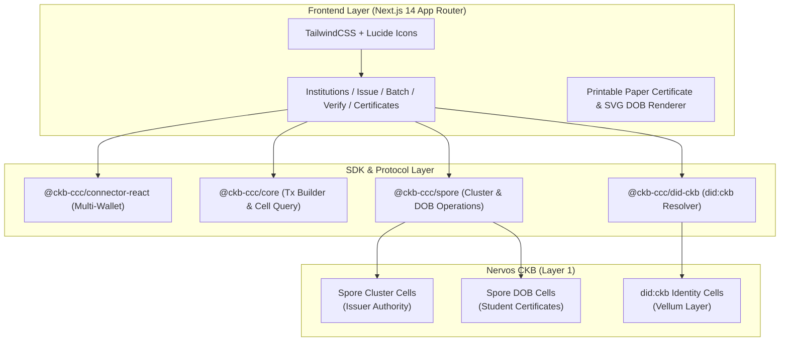
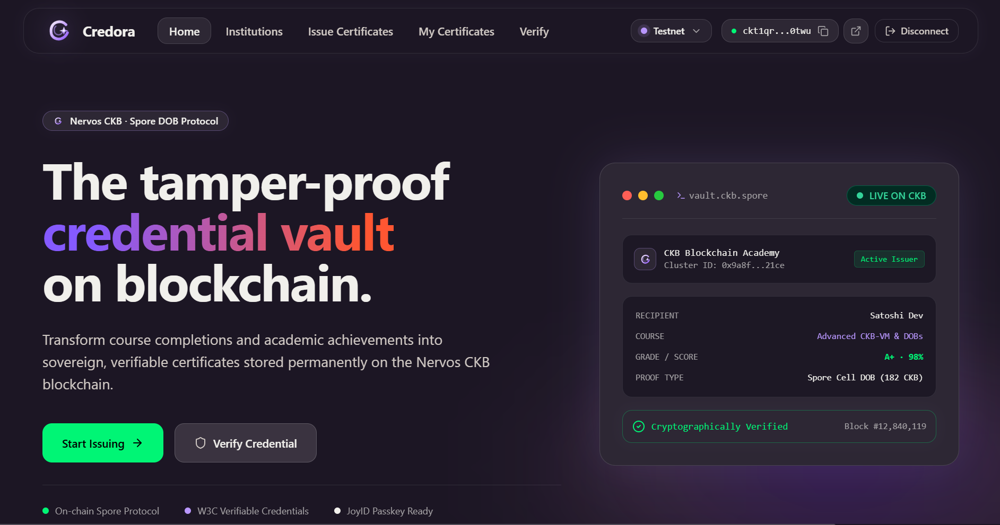
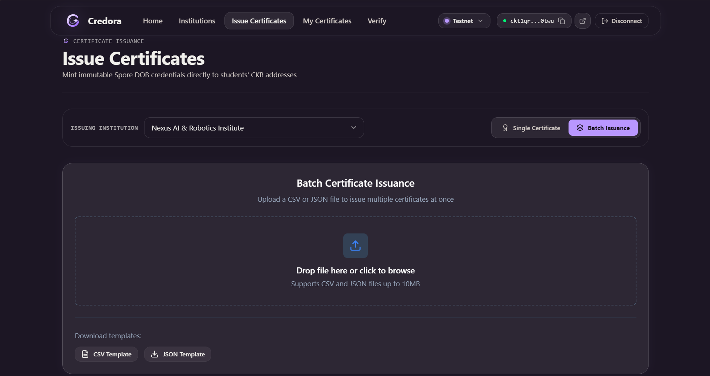
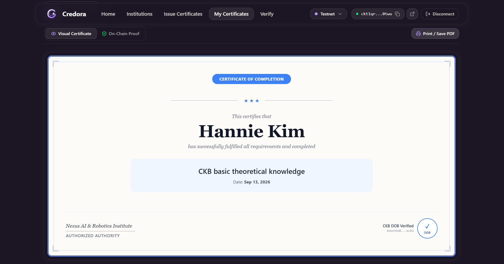
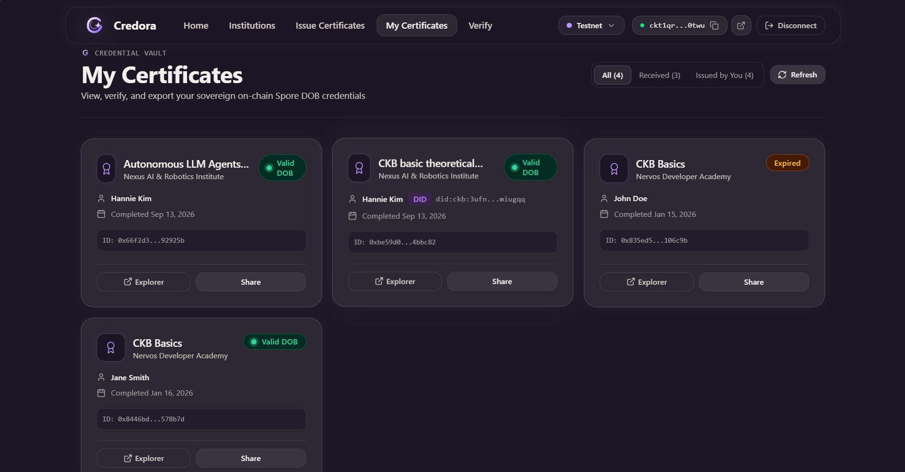
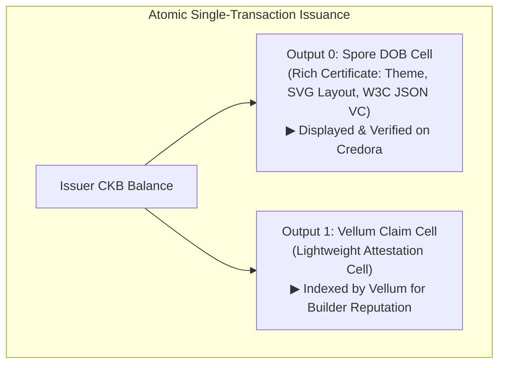

# Credora: On-chain Verifiable Course Credentials on Nervos CKB
## Comprehensive Project Report & Demonstration Guide

> **Project Name:** Credora (CKB Credential Registry)  
> **Repository:** [https://github.com/hiepthach/Credora_CKB](https://github.com/hiepthach/Credora_CKB)  
> **Live Deployment:** [https://credora-ckb.vercel.app/](https://credora-ckb.vercel.app/)  
> **Network:** Nervos CKB Testnet (Pudge) & Mainnet Ready  
> **Date:** September 2026  

---

## 1. Executive Summary

**Credora** is a decentralized, on-chain educational credential issuance and verification platform built natively on **Nervos CKB** using the **Spore Protocol (DOB/0)** and the **CCC SDK**.

In traditional education and online bootcamps, certificates are either stored on centralized servers (vulnerable to link rot and tampering) or issued on EVM blockchains as non-standard NFTs (costly gas fees and disconnected identity). Credora leverages CKB's unique **Cell Model** to turn academic credentials into permanent, self-sovereign digital objects:

1. **Cryptographic Root of Trust:** Each educational institution or course creates an immutable **Spore Cluster** on CKB.
2. **Standardized Verifiable Credentials:** Diplomas are minted as **Spore DOBs** embedding W3C Verifiable Credential metadata directly in on-chain cell data.
3. **Decentralized Identity (`did:ckb`):** Supports issuing credentials directly to portable identifiers via `@ckb-ccc/did-ckb`, connecting achievements to student profiles on [Vellum](https://usevellum.xyz/).
4. **Economic Flexibility:** Built-in **Melt** capability allows holders or issuers to reclaim locked CKB capacity when a certificate expires or is revoked.

---

## 2. Technical Architecture & Stack



### Core Technologies
* **Blockchain:** Nervos CKB (UTXO / Cell Model).
* **Smart Contract Layer:** Spore Protocol v2 (Cluster Type Script, Spore Type Script).
* **Frontend Framework:** Next.js 14, React 18, TypeScript (Strict Mode).
* **Wallet Connector:** `@ckb-ccc/connector-react` supporting **JoyID Passkey**, **MetaMask**, **UniSat**, and CCC private key signers.
* **Testing & Quality Assurance:** Vitest, React Testing Library (**303 tests passing across 34 suites**).

---

## 3. Key Completed Features & Visual Walkthrough

### 3.1 Home & Overview Dashboard
The landing page introduces the platform, showcases recent credentials, displays on-chain statistics, and provides one-click wallet authentication.



* **Multi-Wallet Connection:** Seamless login via WebAuthn Passkeys (JoyID) or browser extensions.
* **Network Switching:** Real-time toggle between CKB Testnet (Pudge) and Mainnet.

---

### 3.2 Single Certificate Issuance (with `did:ckb` Resolution)
Course providers can issue credentials individually to either a standard CKB address (`ckt1...`) or a decentralized identifier (`did:ckb:...`).


* **Instant On-Chain DID Resolution:** Typing a `did:ckb:` identifier automatically queries the CKB indexer, resolves the active lock script, and displays a green verification badge.
* **Custom Layouts & Themes:** Choice of layouts (`classic`, `modern`, `compact`, `badge`, `detailed`) and color palettes.
* **W3C VC Compliance:** Encodes structured metadata including course name, completion date, expiration date, skills, score, and grade.

---

### 3.3 Batch Issuance via CSV & JSON
Designed for universities, academies, and bootcamps graduating dozens or hundreds of students simultaneously.



* **File Parsing & Pre-validation:** Drag-and-drop CSV or JSON files with instantaneous error detection (invalid addresses, missing fields, format errors).
* **Mixed Recipient Rosters:** Supports rosters containing both raw CKB addresses and `did:ckb` identifiers in the same batch.
* **Capacity Estimation:** Automatically calculates required CKB capacity (~151 CKB per certificate) before transaction broadcast.
* **Sample Testing Datasets:** Downloadable template files provided directly in-app and at `/samples/sample_recipients.csv`.

---

### 3.4 Certificate Details & Printable Paper View
Every issued certificate is an interactive digital object with high-fidelity visual rendering.



* **Interactive SVG / HTML Rendering:** Renders dynamically according to the chosen template theme and layout.
* **Printable Paper Certificate:** High-resolution, print-optimized diploma format with custom borders, official typography, and QR code verification.
* **Deep Links to Ecosystem:** Includes direct links to the CKB Explorer and the recipient's public profile on [Vellum](https://usevellum.xyz/).

---

### 3.5 Recipient Dashboard & Token Lifecycle
Students and recipients have a dedicated dashboard to inspect, share, and manage their earned credentials.



* **Received Certificates View:** Automatically indexes all certificates belonging to the connected wallet or associated DIDs.
* **Public Verification Portal (`/verify`):** Anyone can independently verify the cryptographic integrity and validity of a certificate by Spore ID without contacting the issuer.
* **Capacity Reclaim (Melt):** Holders can permanently burn (melt) an expired or invalid certificate, reclaiming the locked CKB capacity back to their wallet.

---

## 4. Ecosystem Interoperability: Vellum & `did:ckb`

Credora is designed to be an active composable component in the Nervos CKB builder and identity ecosystem, connecting directly with [Vellum](https://usevellum.xyz/) ([GitHub](https://github.com/truthixify/vellum/tree/main)).



### Two-Phase Integration Model

| Phase | Standard / Protocol | Status | Deliverable |
| :--- | :--- | :--- | :--- |
| **Phase 1: Identity & Resolution** | `@ckb-ccc/did-ckb` | **Complete (Live)** | Resolves `did:ckb:...` to recipient's active lock script; stores persistent DID in `credentialSubject.id`. |
| **Phase 2: Dual-Output Attestation** | Vellum Claim Cell Protocol | **Proposed / WIP** | Atomic issuance creating Spore DOB + Vellum Claim Cell; immune to wallet lock rotations; updates builder score. |

### Solving the Wallet Lock Rotation Problem
* **The Issue:** Standard UTXO assets are locked to a specific key. If a student rotates their wallet on Vellum (e.g. upgrades to JoyID Passkey), a standard Spore DOB remains locked under the previous address.
* **The Solution:** In Phase 2, the companion Vellum Claim Cell delegates authorization to the student's active DID cell. When the user updates their wallet on Vellum, their reputation points and claim links automatically follow their new address.

---

## 5. Testing, Verification & Quality Assurance

The Credora codebase maintains comprehensive test coverage across unit, integration, and UI component layers.

```
Test Files  34 passed (34)
Tests       303 passed (303)
Duration    13.96s
Typecheck   Clean (0 errors)
```

| Test Suite Category | Coverage Areas | Status |
| :--- | :--- | :--- |
| **Credentials & Encoding** | W3C VC encoder, decoder, cluster management, issuer logic, verifier | ✅ 100% Passed |
| **DID Integration** | `did:ckb` resolver, lock resolution, backward compatibility with addresses | ✅ 100% Passed |
| **Batch Issuance Flow** | CSV & JSON parsing, capacity estimation, row error detection, batch execution | ✅ 100% Passed |
| **UI Components** | PaperCertificate, TemplateShowcase, BatchUpload, Modal, Alert, Badge, Card | ✅ 100% Passed |
| **Lifecycle & State** | Full issuance lifecycle, verification flow, and token melting | ✅ 100% Passed |

---

## 6. Project Deliverables & Links

* **Live dApp (Testnet):** [https://credora-ckb.vercel.app/](https://credora-ckb.vercel.app/)
* **Source Code Repository:** [https://github.com/hiepthach/Credora_CKB](https://github.com/hiepthach/Credora_CKB)
* **Sample Testing Datasets:**
  * CSV Format: [sample_recipients.csv](https://credora-ckb.vercel.app/samples/sample_recipients.csv)
  * JSON Format: [sample_recipients.json](https://credora-ckb.vercel.app/samples/sample_recipients.json)
* **Design Specifications:**
  * Architecture Design: [docs/Design_spec/Architecture_design.md](./Design_spec/Architecture_design.md)
  * Vellum Integration Concept: [docs/Design_spec/09_Vellum_Integration_Design.md](./Design_spec/09_Vellum_Integration_Design.md)

