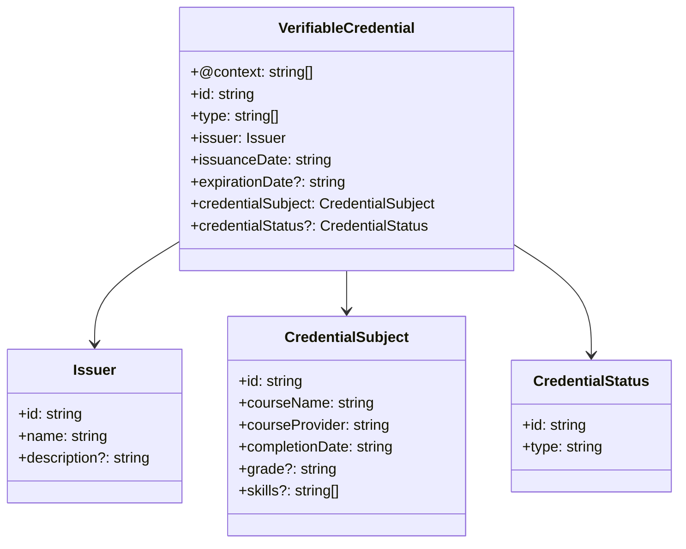
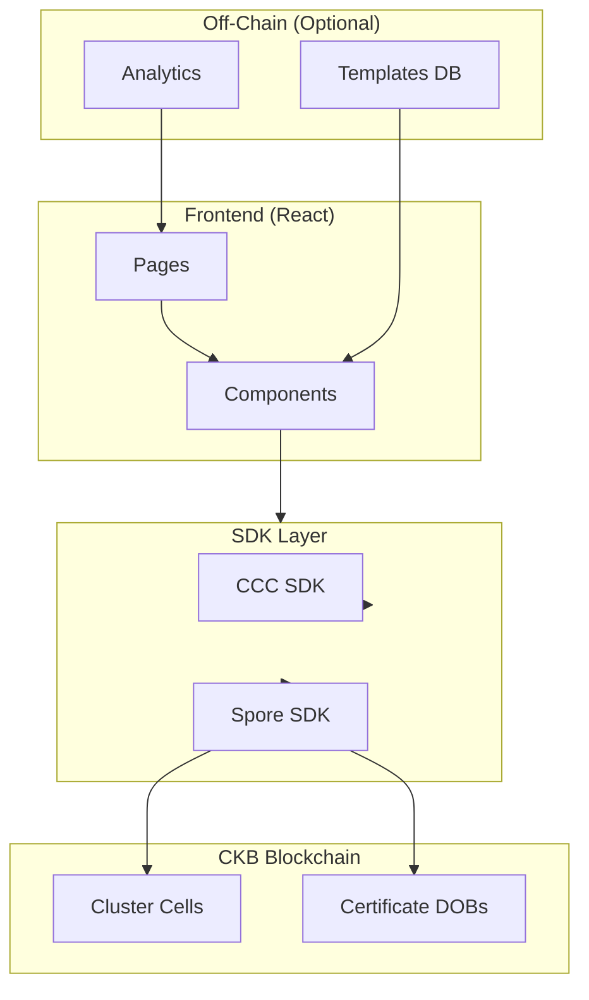
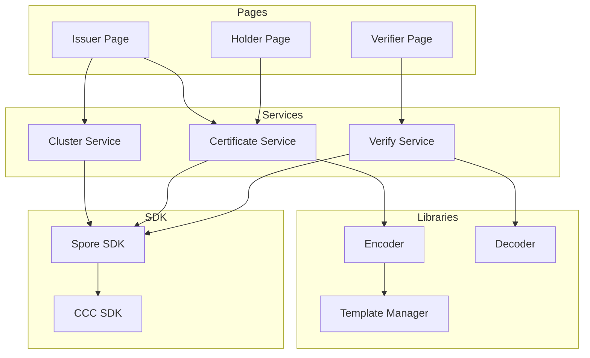

# DOB Credential & Badge Protocol — Project Analysis

> **Updated Scope**: CKB Credential Registry — A focused credential system for course providers, students, and verifiers.

---

## 1. Project Overview

### 1.1 Project Name
**CKB Credential Registry** (DOB Credential & Badge Protocol)

### 1.2 Project Type
Blockchain-native verifiable credentials system built on CKB using the Spore Protocol.

### 1.3 Project Summary

A registry for issuing, managing, and verifying course completion certificates on CKB. Course providers register and issue certificates as Spore DOBs organized in Clusters. Students view and share their certificates. Verifiers can verify certificate authenticity.

### 1.4 Core Value Propositions (Original)

| Feature | Description | Implementation |
|---------|-------------|----------------|
| **Fully On-Chain** | All credential data stored in Spore cells (DNA = credential metadata) | Spore DOB content field |
| **Holder-Owned** | Credentials are NFTs owned by the recipient | Spore DOB lock = recipient wallet |
| **CKB-Backed** | Issuing locks CKB; reclaimable by melting | Spore capacity + melt-to-reclaim |
| **Zero Transfer Fees** | CKB's model allows free credential transfers | CKB UTXO model |
| **Cluster Organization** | Issuers create Clusters; recipients hold DOBs | Spore Cluster + DOB |

---

## 2. Feature Specification

### 2.1 Core Features

| # | Feature | Description | Priority |
|---|---------|-------------|----------|
| **F1** | Course Provider Registration | Providers create Clusters to issue certificates | P0 |
| **F2** | Certificate Issuance | Mint credential DOBs to students | P0 |
| **F3** | Student View | Students see all their certificates | P0 |
| **F4** | Student Share | Share certificate ID or view link | P0 |
| **F5** | Verifier Check | Verify certificate by ID | P0 |

### 2.2 Additional Features

| # | Feature | Description | Priority |
|---|---------|-------------|----------|
| **F6** | Certificate Templates | Pre-defined certificate formats | P1 |
| **F7** | Batch Issuance | Issue multiple certificates at once | P1 |
| **F8** | Expiration | Time-based certificate validity | P1 |
| **F9** | Renewal | Renew expired certificates | P2 |
| **F10** | Melt Certificate | Holder can permanently destroy certificate and reclaim CKB | P1 |
| **F11** | Credential Embedding | Embed certificate on external platforms | P2 |
| **F12** | Issuer Verification | Trust layer for issuers | P2 |
| **F13** | Analytics Dashboard | Provider sees issuance stats | P2 |
| **F14** | Comments/Reviews | Students can comment on certificates | P3 |

### 2.3 Feature Prioritization (MVP vs Extended)

```mermaid
graph LR
    subgraph MVP["MVP (Week 9-10)"]
        F1["Provider Registration<br/>(Cluster)"]
        F2["Certificate Issuance"]
        F3["Student View"]
        F4["Student Share"]
        F5["Verifier Check"]
    end

    subgraph Extended1["Week 11 - Extended"]
        F6["Templates"]
        F7["Batch Issuance"]
        F8["Expiration"]
        F10["Melt Certificate"]
    end

    subgraph Future["Future Releases"]
        F9["Renewal"]
        F11["Embedding"]
        F12["Trust Layer"]
        F13["Analytics"]
        F14["Comments"]
    end

    MVP --> Extended1 --> Future
```



---

## 3. User Roles & Use Cases

### 3.1 User Roles

| Role | Description | Capabilities |
|------|-------------|--------------|
| **Course Provider (Issuer)** | Educational platform, course creator | Register, Issue, Revoke |
| **Student (Holder)** | Certificate recipient | View, Share, Transfer (if allowed) |
| **Verifier** | Anyone checking validity | Verify, View Details |

### 3.2 Use Cases

#### UC1: Provider Registration
```
Actor: Course Provider
Goal: Register as credential issuer
Steps:
1. Provider connects wallet
2. Provider creates Cluster (name, description)
3. System returns Cluster ID
Result: Provider can issue certificates
```

#### UC2: Certificate Issuance
```
Actor: Course Provider
Goal: Issue certificate to student
Precondition: Provider has created Cluster
Steps:
1. Provider enters student wallet address
2. Provider fills certificate data (course name, date, grade)
3. System encodes to W3C VC JSON
4. System creates Spore DOB
5. System sends transaction
Result: Student receives certificate
```

#### UC3: Student View Certificates
```
Actor: Student
Goal: View all certificates
Steps:
1. Student connects wallet
2. System queries all Spore DOBs owned by student
3. System filters for W3C VC credentials
4. System displays certificate list
Result: Student sees all certificates
```

#### UC4: Student Share Certificate
```
Actor: Student
Goal: Share certificate with others
Steps:
1. Student selects certificate
2. Student copies certificate ID
3. OR Student gets explorer link
Result: Certificate ID/link available to share
```

#### UC5: Verifier Check Certificate
```
Actor: Verifier
Goal: Verify certificate authenticity
Steps:
1. Verifier enters certificate ID
2. System queries Spore cell
3. System decodes credential DNA
4. System checks expiration
5. System returns verification result
Result: Verifier knows if certificate is valid
```

#### UC6: Batch Issuance (Extended)
```
Actor: Course Provider
Goal: Issue multiple certificates at once
Steps:
1. Provider uploads CSV/list of recipients
2. Provider confirms batch
3. System creates multiple Spore DOBs in one transaction
Result: Multiple students receive certificates
```

#### UC7: Certificate Melt (Extended)
```
Actor: Certificate Holder
Goal: Permanently destroy a certificate and reclaim CKB capacity
Steps:
1. Holder opens certificate detail
2. Holder clicks "Melt & Reclaim CKB"
3. System prompts for confirmation
4. System creates melt transaction on CKB
5. Spore DOB cell is destroyed, CKB capacity reclaimed
Result: Certificate no longer exists on-chain
```

---

## 4. Data Architecture

### 4.1 Credential DNA Structure (W3C VC Compatible)



### 4.2 Certificate Template Structure

```typescript
interface CertificateTemplate {
  id: string;
  name: string;
  description: string;
  issuer: string; // Cluster ID
  fields: TemplateField[];
  requiredFields: string[];
  defaultValues?: Record<string, any>;
  styling?: {
    logo?: string;
    colors?: string[];
    layout: 'compact' | 'standard' | 'detailed';
  };
}

interface TemplateField {
  name: string;
  type: 'text' | 'date' | 'select' | 'number';
  label: string;
  required: boolean;
  options?: string[]; // For select type
  validation?: {
    min?: number;
    max?: number;
    pattern?: string;
  };
}
```

### 4.3 Cluster Configuration

```typescript
interface ClusterConfig {
  name: string;
  description: string;
  providerInfo: {
    url?: string;
    logo?: string;
    contact?: string;
  };
  certificatePolicy: {
    transferable: boolean;
    expirationDefault?: string; // ISO duration e.g., "P1Y" (1 year)
    allowRenewal: boolean;
  };
  metadata?: Record<string, any>;
}
```

---

## 5. Technical Architecture

### 5.1 System Architecture



### 5.2 Module Design



---

## 6. Implementation Scope

### 6.1 MVP Scope (Week 9-10)

**Features**:
- [x] F1: Course Provider Registration (Cluster creation)
- [x] F2: Certificate Issuance (Single)
- [x] F3: Student View Certificates
- [x] F4: Student Share (Copy ID, Explorer link)
- [x] F5: Verifier Check Certificate

**NOT in MVP**:
- Templates
- Batch Issuance
- Renewal
- Revocation
- Embedding
- Trust Layer
- Analytics
- Comments

### 6.2 Week 11 - Extended (New Scope)

**Features**:
- [x] F6: Certificate Templates (basic)
- [x] F7: Batch Issuance
- [x] F8: Expiration check (UI)
- [x] F10: Melt Certificate (permanent destruction with CKB reclaim)

**NOT in Week 11**:
- Renewal
- Embedding
- Trust Layer
- Analytics
- Comments

### 6.3 Week 12 - Polish (Adjusted)

**Features**:
- [ ] Error handling
- [ ] Loading states
- [ ] Empty states
- [ ] Unit tests
- [ ] Integration tests
- [ ] README
- [ ] Demo

**NOT in Week 12**:
- Analytics Dashboard
- Comments/Reviews

### 6.4 Future Releases (Post-Capstone)

| Feature | Complexity | Notes |
|---------|------------|-------|
| Renewal | Medium | Update expiration date |
| Embedding | Low | iframe or API embed |
| Trust Layer | High | Verified issuers registry |
| Analytics Dashboard | Medium | Provider statistics |
| Comments/Reviews | Low | Social features |

---

## 7. Comparison with Original Scope

### 7.1 What Changed

| Original Scope | New Scope | Change |
|---------------|-----------|--------|
| Multiple credential types (course, event, cert) | Focus on **course certificates** | Simplified |
| POAP-style event badges | Removed | Focus on credential registry |
| Professional certifications | Removed | Focus on course completion |
| General "Credential" abstraction | Course-specific fields | More concrete |

### 7.2 What Remains

| Feature | Status | Rationale |
|---------|--------|-----------|
| Fully on-chain | ✅ | Spore DOB |
| Holder-owned | ✅ | Spore lock script |
| CKB-backed | ✅ | Spore capacity |
| Zero transfer fees | ✅ | CKB native |
| Cluster organization | ✅ | Spore Cluster |

---

## 8. Technical Decisions

### 8.1 Spore DOB Usage

| Decision | Choice | Rationale |
|----------|--------|-----------|
| Content Type | `application/json` | W3C VC JSON format |
| Cluster Usage | One Cluster per Course Provider | Organization boundary |
| Transferability | Configurable per Cluster | Some certs transferable, some not |
| Melt-to-reclaim | Enabled | User can burn to reclaim CKB |

### 8.2 Credential DNA Encoding

```typescript
// Certificate as W3C VC JSON
interface CertificateDNA {
  "@context": [
    "https://www.w3.org/2018/credentials/v1",
    "https://credentials.ckb.dob/v1"
  ],
  "id": "did:ckb:credential:0x...",
  "type": ["VerifiableCredential", "CourseCertificate"],
  "issuer": {
    "id": "did:ckb:issuer:cluster:0x...", // Cluster ID
    "name": "CKB Academy",
    "description": "Official CKB developer training"
  },
  "issuanceDate": "2024-01-15T00:00:00Z",
  "expirationDate": "2027-01-15T00:00:00Z",
  "credentialSubject": {
    "id": "did:ckb:recipient:0x...", // Student wallet
    "courseName": "CKB Development Fundamentals",
    "courseProvider": "CKB Academy",
    "completionDate": "2024-01-10",
    "grade": "A",
    "skills": ["Rust", "CKB-VM", "Cell Model"]
  },
  "credentialStatus": {
    "id": "https://credentials.ckb.dob/status/0x...",
    "type": "StatusList2023Entry"
  },
  "metadata": {
    "clusterId": "0x...",
    "templateId": "0x...",
    "version": "1.0"
  }
}
```

---

## 9. CKB-Specific Advantages

### 9.1 Why CKB for Credential Registry

| Advantage | Description | Impact |
|-----------|-------------|--------|
| **Zero Transfer Fees** | Share certificates without gas | UX improvement |
| **On-Chain Content** | Full certificate in Spore DOB | No IPFS/centralized storage needed |
| **Melt-to-Reclaim** | User can burn certificate | User has control |
| **Cluster Organization** | Natural issuer boundary | Easy to find issuer's certs |
| **UTXO Model** | Each certificate is a cell | Independent, composable |

### 9.2 Comparison with Other Platforms

| Platform | Storage | Transfer Fees | Content |
|----------|---------|---------------|---------|
| **CKB + Spore** | On-chain | Zero | Full certificate |
| Ethereum NFT | Usually IPFS | Gas required | URI reference |
| POAP | IPFS + Polygon | Gas required | Partial on-chain |
| Traditional | Centralized DB | N/A | Full |

---

## 10. Conclusion

### 10.1 Scope Summary

**MVP (Week 9-10)**:
- Provider registration via Clusters
- Single certificate issuance
- Student view and share
- Verifier check

**Extended (Week 11)**:
- Certificate templates
- Batch issuance
- Expiration display
- Revocation

**Future**:
- Renewal
- Embedding
- Trust layer
- Analytics

### 10.2 Core Value Propositions Status

| Feature | Status | Implementation |
|---------|--------|----------------|
| Fully on-chain | ✅ | Spore DOB DNA |
| Holder-owned | ✅ | Spore lock script |
| CKB-backed | ✅ | Spore capacity + melt |
| Zero transfer fees | ✅ | CKB UTXO model |
| Cluster organization | ✅ | Spore Cluster |

---

## References

| Resource | Link |
|----------|------|
| W3C VC Data Model | https://www.w3.org/TR/vc-data-model/ |
| Spore Protocol | https://docs.spore.pro/ |
| DOB/0 Protocol | https://docs.spore.pro/dob/dob0-protocol |
| CCC SDK | https://docs.ckbccc.com |
| CCC Spore SDK | https://github.com/ckb-ecofund/ccc |
